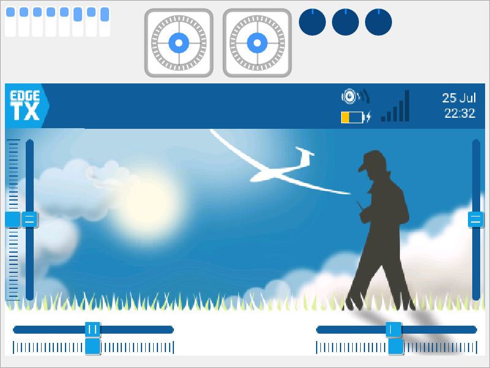
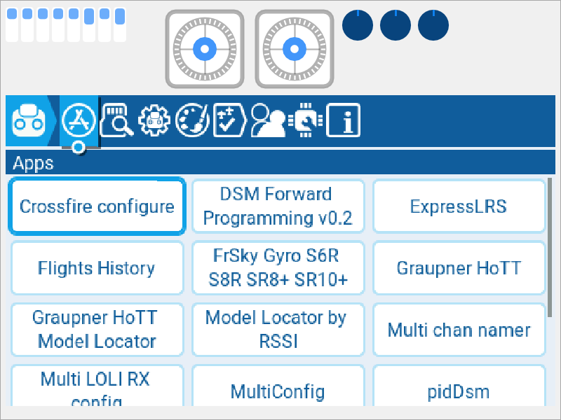
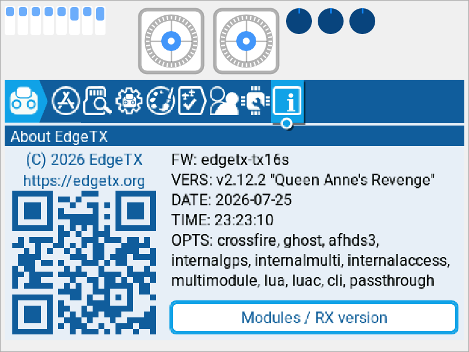
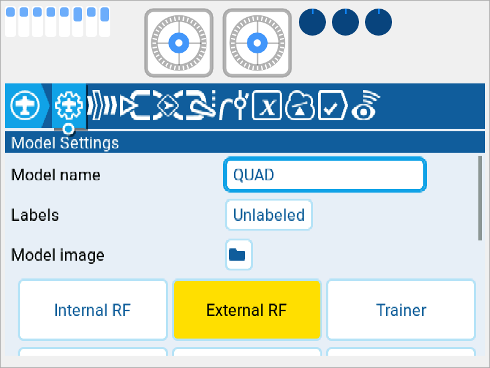

# Симулятор EdgeTX

> Власник документа — **команда** (виняток із таблиці власності, як
> `07-recovery.md`). Перевірено 2026-07-25 на Arch Linux, EdgeTX v2.12.2.

Симулятор — це та сама прошивка, зібрана під ПК: той самий код інтерфейсу,
той самий кадровий буфер **480×272 RGB565**, ті самі меню. Увесь етап 1
(протокол, стиснення, емуляція вводу) робиться тут, без пульта.

## Що саме ми збираємо

EdgeTX має **дві** різні речі зі словом «симулятор»:

| | `simu` | `libsimulator` |
|---|---|---|
| Що це | окремий виконуваний файл на SDL2 + imgui | плагін для Companion |
| Потребує Qt | **ні** | так (Qt6 Core, Widgets, SerialPort, Svg, Xml…) |
| Як запускати | з командного рядка | з вікна Companion |

Нам потрібен **`simu`**. Qt тягне за собою півтори сотні мегабайтів
залежностей заради вікна, яке нам не потрібне, — тому Companion вимикається
прапорцем `DISABLE_COMPANION=ON`.

⚠️ **Без цього прапорця збірка падає**, якщо в системі стоїть частина Qt6.
CMake знаходить `qt6-base`, вирішує будувати Companion і зупиняється на
відсутньому `Qt6SerialPort`:

```
CMake Error at cmake/QtDefs.cmake:16 (find_package):
  Failed to find required Qt component "SerialPort"
```

Це не поломка — це просто інший шлях збірки. `-DDISABLE_COMPANION=ON`
прибирає Qt із розгляду цілком.

## Залежності

### Що вже стояло в системі й пішло в діло

| Пакет | Версія на 2026-07-25 |
|---|---|
| `cmake` | 4.4.0 |
| `gcc` | 16.1.1 (на Arch `g++` входить у `gcc`) |
| `sdl2-compat` | 2.32.70 — дає `SDL2` і файли CMake для нього |
| `python` | 3.14.6 |
| `python-jinja` | 3.1.6 — генератор описів заліза |
| `python-pillow` | 12.3.0 — обробка картинок |
| `git` | 2.55.0 |

### Чого бракувало — рівно одного пакета

```bash
sudo pacman -S python-lz4     # 4.4.5, поставлено 2026-07-25
```

`radio/util/encode-bitmap.py` стискає растрові ресурси інтерфейсу через
`lz4.block`. Без модуля збірка падає на 2 % так:

```
ModuleNotFoundError: No module named 'lz4'
make[3]: *** [radio/src/bitmaps/480x272/…/mask_round_title_left.lbm] Помилка 1
```

### Чого **не** потрібно

- **Qt6** — тільки для Companion, ми його вимикаємо.
- **arm-none-eabi-gcc** — тільки для прошивки в пульт, симулятор збирається
  системним компілятором.

### Запасний шлях без прав root

Якщо `sudo` недоступний, `python-lz4` можна поставити у власне віртуальне
середовище і вказати CMake саме на нього:

```bash
python3 -m venv --system-site-packages ~/.venv/edgetx
~/.venv/edgetx/bin/pip install lz4
# далі до команди конфігурації додати:
#   -DPython3_EXECUTABLE=$HOME/.venv/edgetx/bin/python
```

`--system-site-packages` обов'язковий — інакше в середовищі не буде
`jinja2` і `PIL`, які теж потрібні збірці.

## Збірка

Клон уже стоїть на тезі `v2.12.2` (`tools/setup-upstream.sh`). Перевірити:

```bash
git -C upstream/edgetx describe --tags     # має бути v2.12.2
```

Конфігурація і збірка — дві команди, дослівно:

```bash
cd upstream/edgetx

EDGETX_VERSION_TAG=v2.12.2 cmake --preset simu \
    -DPCB=X10 -DPCBREV=TX16S -DDISABLE_COMPANION=ON

EDGETX_VERSION_TAG=v2.12.2 cmake --build build/simu --target simu -j"$(nproc)"
```

Що означає кожен прапорець:

- `--preset simu` — готовий пресет із `CMakePresets.json`: каталог
  `build/simu`, рідний ланцюжок інструментів, `NATIVE_BUILD=ON`,
  `EdgeTX_SUPERBUILD=OFF`.
- `-DPCB=X10 -DPCBREV=TX16S` — саме наш пульт. `X10` — сімейство,
  `TX16S` — конкретна ревізія (звірено з `tools/boards.py`). Дає
  `-DRADIO_TX16S` і `FLAVOUR=tx16s`.
- `-DDISABLE_COMPANION=ON` — без Qt, див. вище.
- `EDGETX_VERSION_TAG=v2.12.2` — щоб симулятор називав себе так само, як
  прошивка в пульті. Без цієї змінної версія буде
  `pre-2.12.2-selfbuild (3673c518)`: те саме, зібране з того самого коміту,
  але з іншим підписом. Обидва варіанти робочі, різниця тільки в рядку.

⚠️ Перша конфігурація **лізе в мережу**: `FetchContent` тягне imgui
(`ocornut/imgui` v1.91.8) і googletest у `build/simu/_deps`. Без мережі
конфігурація не пройде.

### Скільки це триває

Заміряно з **порожнього** каталогу `build/simu`, 16 ядер (`nproc` = 16),
саме цими двома командами і без жодних додаткових прапорців:

| Крок | Час |
|---|---|
| Конфігурація (разом із завантаженням imgui й gtest) | 27 с |
| Збірка `-j16` | 98 с |
| **Разом** | **125 с** |

Конфігурація лізе в мережу, тому її час гуляє: у попередньому прогоні було
35 с проти 27 с тут. Час самої збірки стабільний.

Каталог збірки після цього — 216 МБ. Виконуваний файл:

```
upstream/edgetx/build/simu/simu     56 024 952 байти
```

Каталог `build*/` уже перелічений у `.gitignore` самого EdgeTX, тому
`git -C upstream/edgetx status --short` лишається порожнім.

## Запуск

⚠️ **Тільки на копії картки.** Симулятор **пише** в неї: оновлює
`RADIO/radio.yml`, `MODELS/labels.yml`, поточну модель і компілює
Lua-скрипти в `.luac` поруч із `.lua`. Оригінали в `sd-backups/` — наш
єдиний шлях назад.

```bash
mkdir -p build/sim-card
cp -a sd-backups/upgrade-2.12.2/card-new/.               build/sim-card/
cp -a sd-backups/upgrade-2.12.2/card-after-boot/MODELS/. build/sim-card/MODELS/
cp -a sd-backups/upgrade-2.12.2/card-after-boot/RADIO/.  build/sim-card/RADIO/

upstream/edgetx/build/simu/simu --storage "$PWD/build/sim-card"
```

⚠️ Крапка в кінці шляху-джерела (`card-new/.`) обов'язкова. Без неї, якщо
`build/sim-card` уже існує, `cp -a` покладе картку **всередину** —
`build/sim-card/card-new/` — і симулятор побачить порожню картку.

Другий і третій рядок кладуть поверх повної картки ті `MODELS/` і
`RADIO/radio.yml`, які пульт записав **після** першого запуску 2.12 — тобто
стан, який у пульті зараз.

### Аргументи командного рядка

```
--width <n>     ширина вікна (типово 800)
--height <n>    висота вікна (типово 600)
--storage <шлях> каталог, який стає SD-карткою
--settings <шлях> каталог налаштувань
-h, --help
```

Шлях до картки має бути **абсолютним**.

### Клавіші

Розкладка зашита у `radio/src/targets/simu/sdl_simu.cpp`:

| Клавіша | Що це на пульті |
|---|---|
| `Enter` | ENTER |
| `Esc` | EXIT / RTN |
| `S` | SYS |
| `M` | MDL |
| `T` | TELE |
| `PageUp` / `PageDown` | сторінки меню |
| `↑` `↓` | обертання енкодера (на TX16S саме енкодер, не клавіші) |
| `R` | перезапустити прошивку в симуляторі |
| `L` / `D` | світла / темна тема самого вікна симулятора |

Мишею по зображенню екрана — це **сенсорний екран**: натиск дає
`touchPanelDown(x, y)`, відпускання — `touchPanelUp()`. Координати
перераховуються з масштабу вікна в координати екрана автоматично
(`radio/src/targets/simu/widgets.cpp`, `SimuScreenMouseEvent`).

### Як це виглядає

| | |
|---|---|
| Головний екран, тема з нашої картки |  |
| Системне меню, вкладка Apps — Lua-скрипти з картки |  |
| Версія: `v2.12.2 "Queen Anne's Revenge"` |  |
| Налаштування моделі QUAD |  |

## Розмір екрана

Вікно типово 800×600, але **кадровий буфер усередині — рівно 480×272**,
як у пульта. Вікно лише розтягує його, зберігаючи співвідношення сторін:

- `radio/src/targets/horus/hal.h:1264` — `LCD_W 480`, `LCD_H 272`,
  `LCD_DEPTH 16`;
- `sdl_simu.cpp:754` — текстура створюється як `LCD_W × LCD_H`;
- `sdl_simu.cpp:545` — `calc_screen_size()` вписує її у вікно.

Для нас це головне: захоплювати ми будемо той самий буфер 480×272 RGB565,
що й на залізі.

## Граблі

1. **Порожній лог і миттєва смерть процесу.** Якщо запускати симулятор із
   фонового підпроцесу, він гине разом із оболонкою. Запускати через
   `setsid nohup … &` або просто у власному терміналі.

2. **`pkill -f simu` вбиває власну сесію.** Шаблон `-f` збігається з
   командним рядком самої оболонки, у якому це слово теж є. Правильно —
   `pkill -x simu`.

3. **Попередження на старті.** Перший запуск зустрічає двома вікнами:
   `THROTTLE WARNING` (газ не в нулі) і `CONTROL WARNING` (перемикачі не в
   типових положеннях). Обидва закриваються будь-якою клавішею. Це не
   помилка збірки, це звичайна поведінка EdgeTX.

4. **Wayland і синтетичний ввід.** Під KDE Plasma на Wayland KWin ігнорує
   події XTEST — автоматизувати ввід через X11 не вийде. Робочий шлях:
   `/dev/uinput` (у нас доступний користувачу через ACL сеансу) плюс
   `python-evdev`. Для зняття знімків вікна зручно запускати симулятор під
   XWayland: `SDL_VIDEODRIVER=x11 …`, далі
   `magick import -window <id>`. Людині за клавіатурою нічого з цього не
   потрібно — це тільки для автоматичних перевірок.

5. **`PAGEUP` із першої вкладки перестрибує на останню**, а не лишається на
   місці. Дрібниця, але збиває, коли рахуєш кроки навігації.

6. **Симулятор смітить `imgui.ini` у поточному каталозі** — imgui зберігає
   туди розкладку свого вікна. Файл додано до `.gitignore`.
