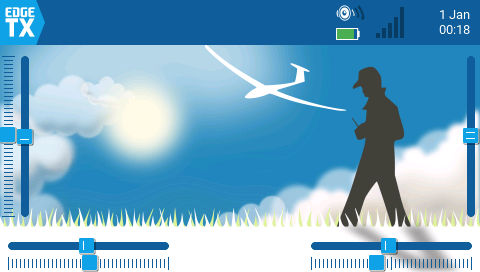

# Поточний стан

> Оновлюється командою `/handoff`. Це знімок стану, а не журнал.
> Історія — у `state/handoffs/`.

**Етап:** 2.7. Кроки 2.6 і збірка прошивки **закриті й прийняті**
**Статус:** задача 0014 **прийнята**; наступна — 0013
**Оновлено:** 2026-08-01

## Фокус зараз

# 🎉 Ми знову вміємо збирати прошивку. І в пульті лежить саме вона.

Задача [0014](../tasks/0014-native-firmware-build.md) **прийнята рецензією**:
усі троє воріт пройдені. Прошивка збирається **нативно, без docker**,
пінованим `arm-none-eabi-gcc 14.2.1`, залита в пульт і перевірена на стенді.

**Чому це було терміново.** Після перевстановлення системи зник docker, а з
ним — прив'язана версія компілятора. У пульті лежала збірка, яку **не було
чим повторити**, і будь-яка подальша зміна прошивки — включно з 2 Мбод —
була неможлива. Тепер це закрито.

⚠️ **І це виявилось не побоюванням, а фактом.** Крок 0 воріт B зчитав
пам'ять пульта й порівняв її з новою збіркою: **316 989 різних байтів із
1 599 788**. Завантажувач при цьому збігся **побайтово**.

### Як тепер зібрати прошивку пульта

```sh
tools/setup-toolchain.sh          # ідемпотентний: компілятор + Python-залежності
export PATH="$PWD/toolchain/arm-gnu-toolchain-14.2.rel1-x86_64-arm-none-eabi/bin:$PATH"
export CPATH="$PWD/toolchain/arm-gnu-toolchain-14.2.rel1-x86_64-arm-none-eabi/lib/gcc/arm-none-eabi/14.2.1/include"
```

Далі — команди, які друкує сам скрипт наприкінці.

⚠️ **Системний `arm-none-eabi-gcc` (16.1.0) не підходить:** EdgeTX пінує
`14.2.rel1` і зупиняє збірку жорстким `FATAL_ERROR` ще до компіляції.
`USE_UNSUPPORTED_TOOLCHAIN` для збірок, що йдуть у пульт, **заборонений**
рішенням людини. ⚠️ `CPATH` обов'язковий: `libclang` з PyPI не знає, де
лежить `stdbool.h` компілятора, і `generate_datacopy.py` без нього падає.

### Регресії від заміни компілятора немає — заміряно на стенді

| Що | Тепер | Було до заміни |
|---|---|---|
| Флеш | 1562.27 КБ, вільно 485.73 з 2048 | 1562.20 / 485.80 |
| Канал під навантаженням | **89.4%** | 90.1% і 90.5% |
| `Tmix max` | **0.46 мс із 4 мс** | 0.46 (дріт), 0.47 (Wi-Fi) |
| Втрати за весь сеанс | **нуль на всіх лічильниках** | нуль |

Відпускання вводу при розриві працює: міст помітив втрату сокета **сам**
(`silence_timeouts` не зросло), і пульт після обриву **стояв нерухомо**.

### Наступний крок — задача 0013

[0013](../tasks/0013-bench-debts.md) — борги стенда, і в ній з'явився
**новий критерій 4-біс**: хибне спрацювання сторожа мовчання під
навантаженням. У 0014 сторож разово відпустив ввід посеред живої сесії при
89% каналу, хоча клієнт слав ввід раз на 250 мс.

⚠️ **Розбиратися треба до 2 Мбод, поки воно відтворюється.** 2 Мбод
зменшать завантаження каналу приблизно вдвічі, симптом найімовірніше зникне
— а причина лишиться й повернеться на важчому екрані.

Стенд лишається зібраним, новий підйом не потрібен.

**Ланцюг «пульт → ESP32 → Wi-Fi → телефон» працює на живому залізі.** Екран
пульта на телефоні, дотик доходить до пульта. Знімок —
`docs/img/bridge/02-radio-screen-over-wifi.png`.

За сеанс: **17.3 МБ трафіку, 95 905 пакетів, нуль помилок CRC і нуль втрат
на всіх трьох лічильниках** (`crc_errors`, `uart.dropped`,
`ws.tiles_dropped`).

### Чотири відповіді, яких досі не було

| Питання | Відповідь |
|---|---|
| Чи Wi-Fi додає затримки | **Ні.** Повна перемальовка 1096 мс проти дротових 1149, дрібна зміна 88 проти 95 |
| Чи мікшер терпить Wi-Fi поруч | **Так.** `Tmix max` 0.47 мс із 4 мс під навантаженням (на дроті 0.46) |
| Чи міст відпускає ввід при справжньому розриві | **Так, за 184 мс** проти 1000 мс тайм-ауту прошивки |
| Чорний прямокутник із 0010 | **Вада знімача, не втрата плитки.** Питання закрите |

⚠️ **Скарга «повільно, 3–6 кадр/с» — це не міст.** Вузьким місцем лишається
дріт на 921600 бод, той самий, що в 0010. Важіль — **2 Мбод**, окрема задача.

### Що лишилось незакритим

⚠️ **C2 — числа відпускання вводу не зняті.** Ввід відпускається обома
способами, але `release_watch.py` має **ваду насичення**: тример доїжджає до
упору й перестає рухати канал, хоча його тримають. Розкид 0…1829 мс.
Правка в `tools/` — наступна задача.

⚠️ **Мовчазний RST:** клієнт, що перестав читати ~3 с, втрачає сокет, а
`ws.errors` і `send_dropped` лишаються нулями. Рішення від 2026-07-27
«сторож мовчання сокет не рве» на залізі має невиконану передумову.
Рішення за асистентом.

⚠️ **Фаза 5 не проводилась і в задачу не входила.** Конденсаторів і
корпуса-роз'єма Dupont 1×4 фізично немає — борг `docs/09-bom.md`.

### Пастка, на якій сеанс втратив найбільше часу

**Заміри вимагають рівно одного клієнта.** Телефон і клієнт із ПК витісняли
один одного — **53 з'єднання і 53 розриви** за сеанс, і це давало несправжні
«дірки» в кадрі та `BrokenPipeError` посеред замірів. Друга пастка:
**лічильники стоять при відсутньому клієнті — це норма**, пульт мовчить у
порожній канал, а таблиця діагностики фази 4 такого рядка не має.

### ⚠️ Середовище розробки зникло, репозиторій уцілів

Систему перевстановлено: немає ні `~/.espressif`, ні розширень VS Code, ні
`docker`, ні `~/Проекти`. ESP-IDF v5.5.4 поставлено наново:

```sh
. ~/esp/esp-idf/export.sh     # НЕ activate_idf_v5.5.4.sh — його більше немає
```

Збірка моста дала **той самий розмір** (843 536 Б, 45% розділу вільно), тобто
відтворюваність підтверджена. ✅ **Борг «прошивку зібрати нічим» закритий
задачею 0014** — docker не потрібен, набір інструментів ставиться
`tools/setup-toolchain.sh`.

### Власник збірки моста — `idf.py`, не PlatformIO

Крок 2.6a відповів на своє питання заміром. Глобального `IDF_PATH` у системі
**немає й не було** — головна пастка не спрацювала. Два розширення VS Code
роблять різні речі й не перетинаються: PlatformIO — Arduino-середовище
людини (усі **17** проєктів на диску — `framework = arduino`), розширення
ESP-IDF — наш IDF **v5.5.4**, поставлений EIM рівно під `esp32` і `esp32c3`.

PlatformIO дотягнув би **третю** копію ESP-IDF і **старішу** (5.3.2 або
5.5.3), бо `framework-espidf` не завантажений у жодної з двох його платформ.
Суть ADR-0004 — чистий IDF без Arduino — збережена; змінився лише збирач, що
сам ADR і дозволяє. Місця не звільняли: рішення людини, і «12 ГБ» там усе
одно немає — безпечно звільнялося б ~1.6 ГБ.

### Що вже працює, доведено без заліза

Обидві цілі збираються без жодного попередження: **ESP32 844 КБ** (45%
вільно), **C3 877 КБ** (42%).

| Перевірка | Чим |
|---|---|
| кадрування моста, **79** перевірок | `firmware/esp32/test/test_framing.c` |
| протокол клієнта, **68** перевірок | `node webui/proto_test.js` |
| протокол на ПК, **66** тестів | `python3 tools/proto_test.py` |
| увесь ланцюг на симуляторі | `node tools/webui_probe.js` |

⚠️ **Уся оснастка вміє говорити з мостом.** `WsTransport` дав WebSocket той
самий інтерфейс, що вже мали TCP і послідовний порт, тож
`tools/test_client.py --ws ws://192.168.4.1/ws` покаже екран пульта через
ESP32 **тим самим кодом**, яким показував через дріт.

**Відпускання вводу міряється збоку** — `tools/release_watch.py`, через режим
USB-джойстика. Лічильники моста кажуть «я надіслав обнулений `INPUT_STATE`»,
а питання стоїть інакше: «чи пульт відпустив».

⚠️ **Три еталонні вектори збігаються в трьох реалізаціях** — C++ у пульті,
Python в інструментах, JS у браузері. Це те, що робить `docs/03-protocol.md`
специфікацією, а не переказом коду.

**Клієнт у браузері малює екран пульта цілком** — `HELLO` дає
`tx16s 2.12.2-remoteui, 480×272`, прапорці `0x0B`, сім клавіш; битих плиток
0, поза екраном 0, помилок CRC 0, пофарбовано 100% пікселів. Клавіша й
проведення пальцем доходять до пульта. Знімок —
`docs/img/bridge/01-webui-main-screen.png`.

**Головна вимога безпеки перевірена трьома способами:** розрив сокета,
мовчання телефона при живому сокеті і витіснення новим телефоном — усі три
дають обнулений `INPUT_STATE`. ⚠️ Поки що на **програмному двійнику моста**,
не на ESP32.

⚠️ **Сторож мовчання відпускає ввід, але сокет не рве** — це два різні
висновки. Згаслий екран телефона (браузери душать таймери у фоні) інакше
коштував би перепідключення й повного `REFRESH` саме там, де міряємо
затримку.

**Клієнта можна крутити без заліза взагалі:** `tools/webui_serve.py` — міст
на ПК, який віддає ті самі файли й перекладає в симулятор. Та сама причина,
з якої існує `test_client.py`.

---

# 🎉 Пульт заговорив по дроту.

**Екран справжнього пульта видно на комп'ютері.** Задача
[0010](../tasks/0010-first-flash.md) закрила кроки 2.3, 2.4 і 2.5: прошивка
залита й звірена побайтово, порт налаштовано наосліп, кабель під'єднано,
заміри зняті.



Рукостискання спрацювало **з першої спроби**: `PING` → `HELLO` за 10 мс, нуль
помилок CRC.

### ⚠️ Мікшер циклів не пропускає — головна перевірка безпеки з ТЗ

Заміряно, а не виведено: скинули лічильник, наситили канал на 25 с,
перечитали. **`Tmix max` 0.46 мс із 4 мс періоду — під навантаженням не
зрушило взагалі.**

### Причина підлагування названа: дріт насичений

| Що | Час | Канал |
|---|---|---|
| Спокій | — | **0 Б/с** |
| Дрібна зміна | 95 мс, 9 плиток | 39 КіБ/с |
| Рух | 8.3 кадр/с | **90.1%** |
| Повна перемальовка | 1149 мс, 93.8 КіБ | **90.5%** |
| Аналізатор спектра | 2.85 кадр/с | **90.4%** |

Дрібні зміни швидкі, повільні тільки великі — і рівно настільки, скільки
важать байти. Розкид між прогонами ±0.4%: процес, обмежений процесором, так
не поводиться. **Плиток не відкидається жодної** — деградація плавна.

⚠️ Важіль 2 Мбод тут перевірити неможливо: у ланцюзі CP2102 зі стелею 1 Мбод.
Це крок для справжнього моста (2.6).

⚠️ **Стенд після сесії розібраний** — `/dev/ttyUSB0` більше немає. Для будь-якої
перевірки на живому залізі його треба піднімати заново.

**Відкритий хвіст:** чорний прямокутник на
`docs/img/radio/03-debug-mixer-under-load.png`. Найімовірніше — вада
чернеткового скрипта знімання, а не втрата плитки: три інші знімки цілі, а
`03` єдина сторінка, що оновлюється безперервно, і дірка лежить рівно на
найшвидше змінюваних числах. Лічильники клієнта за весь сеанс нульові.
**Але живої перевірки не було.** Проба на 30 секунд, коли стенд підніметься —
у handoff `2026-07-26-11`.

### Пам'ять на живій прошивці

Флеш 485.80 КБ вільно з 2048; купа 3 950 576 Б; стеки — `menusTask` 10 668 Б,
мікшер 600 Б, звук 1120 Б. За сеанс не змінилось ні на байт.

---

Попередня задача [0009](../tasks/0009-uart-transport.md) закрила кроки 2.1 і 2.2:
режим порту `REMOTE_UI` на AUX1, транспорт із прямим доступом до пам'яті на
передачу, усі дев'ять пунктів переліку гачків накладені.

**Транспорт крутить власна задача FreeRTOS, пріоритет 2** — на щабель вище за
малювання (1) і на два нижче за мікшер (4). Мікшер і звук витісняють її завжди,
тобто радіоканалу вона зачепити не може за побудовою. Службову задачу таймерів
не взято навмисно: у ній крутиться `per10ms()` разом з опитуванням клавіш і
телеметрія раз на 2 мс.

⚠️ **Транспорт нікого не чекає:** `waitForTxCompleted()` не викликається жодного
разу, `txCompleted()` працює воротами, плитка що не влізла — повертається в
брудні.

**Вміщується з запасом** (числа з карти пам'яті, не з паперу):

| Пам'ять | без `REMOTE_UI` | з ним | вільно після |
|---|---|---|---|
| Флеш | 1558.09 КБ | 1562.20 КБ (+4.11) | **485.80 КБ** із 2048 |
| Внутрішня ОЗП | 67 088 Б | 82 064 Б (+14 976) | **114 544 Б** із 196 608 |
| CCM | 50 936 Б | 52 984 Б (+2 048) | **12 552 Б** із 65 536 |
| SDRAM | 3 404 032 Б | 3 665 152 Б (+261 120) | ~4.5 МБ із 8 МБ |

⚠️ **Тіньова копія кадру справді в SDRAM** — `s_shadow` на `0xD02BF900`, за
символами з `firmware.elf`, а не за наміром. Буфер передачі `s_txBuf` на
`0x20011D5C`, тобто між `_sram` і `_eram`: інакше `_IS_DMA_BUFFER()` не
проходить, драйвер тихо падає на побайтовий запис і викидає байти при
переповненні черги. Найтісніше — **CCM, 80.85%**.

**Незмінність без прапорця доведено побайтово:** `firmware.bin` із цього дерева
з `REMOTE_UI=NO` збігається зі збіркою з чистого дерева EdgeTX
(`a974beba…`). Це сильніше за порівняння об'єктників із 0007/0008 — і потрібно
було саме тепер, бо гачки зачіпають заголовки, які включає майже все дерево.

⚠️ **Дві рецензії, і друга спіймала дефект, внесений виправленням першої.**
Перевірка порту стояла після опускання воріт — рядок `mode: REMOTE_UI` під AUX2
тихо вбивав би робочий AUX1. Разом знайдено п'ять вад, жодної з них не бачили
96 тестів.

**Борг біта3 `HELLO` закрито з обох боків.** Живий `HELLO` симулятора віддає
прапорці `0x0B`; підміна біта в прийнятому байті перемикає клієнта на `PING`
раз на 250 мс — 7 пакетів за секунду утримання, 0 коли нічого не утримується.

**Залипання вводу закрито з обох боків.** Задача
[0008](../tasks/0008-input-state-and-encoder.md) прийнята: пакет `0x87
INPUT_STATE` повторює **рівень** вводу раз на 250 мс, і втрачений поодинокий
пакет «відпущено» самолікується за один період. Доказ — проба на **точкову
втрату**, не на обрив: той самий тример, та сама збірка, без повтору стану
**37 кадрів** і останній на **2481 мс**, з повтором — **3** і **368 мс**.
Дотик окремо: кнопка, що спрацьовує на відпусканні, застигає втиснутою на
2500 мс проти відпускання на **147 мс**. Знімки — `docs/img/input/0008-*`.

⚠️ **Тайм-аут відпускання тепер відсувають лише пакети, що несуть ввід** —
`KEY`, `ENC`, `TOUCH`, `TRIM`, `INPUT_STATE`. `PING`, `REFRESH` і невідомі
типи — ні. Це зміна чинної поведінки заради моста ESP32: він власний
посередник і може слати `PING` після того, як телефон від'єднався.

⚠️ **Дві вади знайшла рецензія, а не 92 тести, що проходили.** Писар і читач
скидали прапорці дотику незалежно, тому при спрацюванні тайм-ауту рівень
«пальця немає» переставав породжувати перехід — і лікувальний пакет не лікував
рівно того випадку, заради якого писався. Виправлено через епоху з'єднання.

**Прискорення енкодера працює:** три одиночні клацання дають 2026 → 2029,
тобто +1 на клацання замість +26. Гачок отримав рівно один рядок.

**Пультом можна керувати з клієнта повністю.** Задача
[0007](../tasks/0007-input-emulation.md) прийнята: клавіші, тримери, енкодер і
сенсор підмішуються в **драйвери** EdgeTX, тому довге натискання, автоповтор і
прискорення дає сам EdgeTX — ми їх не програмували. Крок **1.6 у плані
закрито**.

Критерій виходу з етапу 1 закрито доказом, а не словами: із клієнта зайшли в
налаштування моделі, **дотиком** змінили `Timer 1 Start` з `00:00` на `00:03`,
вийшли, **перезапустили симулятор** — значення на місці, і в
`MODELS/model3.yml` лежить `start: 3`. Меню Lua-скрипта ELRS відкрито дотиком,
вихід із нього — **довгим натисканням**. Знімки — `docs/img/input/`.

⚠️ **Головне в цій задачі — не ввід, а відпускання.** Два рубежі, кожен
перевірено на живому симуляторі: розрив зв'язку відпускає все негайно, тиша в
каналі понад **1000 мс** — теж, причому відпускає **сам читач** (задачі EdgeTX),
тому мертвий потік транспорту нічого не залишить натиснутим. Тример під
обірваним зв'язком: **0 різних пікселів** за наступні 2.5 с.

**Борг із 0006 закрито:** `REFRESH` завжди завершується `FRAME_END`. Лічильник
«без FRAME_END» у клієнті стоїть на нулі й лишився сторожем.

Затримка: клацання енкодера → перший кадр **45 мс** (22…80), перемальовка
всього екрана **208 мс** (197…239). Це числа для порівняння на кроці 2.5.

**Екран пульта видно у вікні живцем.** Задача
[0006](../tasks/0006-test-client.md) прийнята: `tools/test_client.py` — вікно
на tkinter, розмір береться з `HELLO`, TCP і послідовний порт за одним
інтерфейсом, 29 тестів у `tools/proto_test.py` зі звіркою по еталонних
векторах задачі 0004. Знімки — `docs/img/client/`.

У русі: одне натискання — один кадр, реакція 37–48 мс, затримка не
накопичується (хвіст 31–44 мс на будь-якій швидкості), блимання й рваних
кадрів не знайдено в записі вікна на 60 к/с.

⚠️ **Канал стане вузьким місцем.** Швидка прокрутка просить 230 КіБ/с,
Lua-скрипт 162, а 921600 бод дають ~90. Відповідь — **плавна деградація**:
плитка, що не влізла, лишається брудною і йде наступним кадром; кадри
рідшають, але кожен показаний кадр цілісний. 2 Мбод перевіряємо на кроці 2.5
(стеля 1 Мбод з ADR-0003 — це CP2102 на стенді, у виробі його немає).

**Захоплення екрана працює.** Задача [0005](../tasks/0005-screen-capture.md)
прийнята: гачок `remoteUiOnFlush` на початку `flushLcd()`, RLE16, TCP замість
UART у симуляторі, PNG як доказ (`docs/img/capture/`). Стиснення на живих
екранах — від 2.74× на фотографічній темі до 14.9× на однотонному
попередженні; дія в меню коштує 10–16 КБ, тобто 6–9 дій за секунду на
921600 бод.

**Ми вже в чужому дереві, і виходимо з нього однією командою.** Наш код не
копіюється в EdgeTX — туди веде symlink; гачки лежать патчем на 88 рядків у
дев'яти файлах.

```sh
tools/patch-apply.sh     # symlink + hooks.patch
tools/patch-revert.sh    # назад; після нього дерево EdgeTX чисте
tools/patch-update.sh    # зняти правлені в upstream гачки назад у патч
```

Збірка симулятора з нашим кодом:

```sh
EDGETX_VERSION_SUFFIX=remoteui cmake --preset simu \
    -DPCB=X10 -DPCBREV=TX16S -DDISABLE_COMPANION=ON -DREMOTE_UI=ON
cmake --build upstream/edgetx/build/simu --target simu -j$(nproc)
```

⚠️ **Збірка прошивки під пульт — нативна, docker більше не потрібен**
(задача 0014, замінює попередню інструкцію через `ghcr.io/edgetx/edgetx-dev`).
Набір інструментів ставить `tools/setup-toolchain.sh` — деталі на початку
цього файлу:

```sh
tools/setup-toolchain.sh
export PATH="$PWD/toolchain/arm-gnu-toolchain-14.2.rel1-x86_64-arm-none-eabi/bin:$PATH"
export CPATH="$PWD/toolchain/arm-gnu-toolchain-14.2.rel1-x86_64-arm-none-eabi/lib/gcc/arm-none-eabi/14.2.1/include"

cd upstream/edgetx && mkdir -p build-fw && cd build-fw
cmake -DCMAKE_BUILD_TYPE=Release -DPCB=X10 -DPCBREV=TX16S \
      -DREMOTE_UI=YES -DEdgeTX_SUPERBUILD=YES \
      -DPython3_EXECUTABLE="$PWD/../../../toolchain/py-fw-build/bin/python3" ..
cmake --build . --target arm-none-eabi-configure -j$(nproc)
cmake --build arm-none-eabi --target firmware -j$(nproc)
```

Звіт про розмір — тим самим інструментом, яким його друкує сам EdgeTX:
`radio/util/elf-size-report.sh --mcu=STM32F429xI <elf> [<elf2>]` (два файли
дають ще й порівняння).

### Збірка моста ESP32 — `idf.py`, не PlatformIO

Крок 2.6a закрито. **Власник збірки — розширення ESP-IDF**, тобто `idf.py` на
ESP-IDF **v5.5.4**, що вже стоїть у `~/.espressif`. PlatformIO лишається
Arduino-середовищем людини і до цього проєкту не має стосунку.

```sh
. ~/.espressif/tools/activate_idf_v5.5.4.sh   # точково, у тому терміналі, де збираєш
cd firmware/esp32
idf.py set-target esp32                       # DevKit v1
idf.py build
idf.py -p /dev/ttyUSB0 flash monitor

# C3 SuperMini — окрема тека збірки, без перемикання цілі туди-сюди
idf.py -B build-c3 -DIDF_TARGET=esp32c3 build
```

⚠️ **Глобального `IDF_PATH` у системі немає і не було** — пастка кроку 2.6a не
спрацювала. Активація точкова, через скрипт EIM. Якщо `IDF_PATH` колись
з'явиться в профілі оболонки — це і буде причиною незрозумілих помилок збірки.

Звідки береться кожен інструмент: `xtensa-esp-elf-gcc 14.2.0` і
`riscv32-esp-elf-gcc 14.2.0` — з `~/.espressif/tools`, Python 3.14.6 — з venv
IDF (`~/.espressif/tools/python/v5.5.4/venv`), ninja 1.12.1 — звідти ж, а
`cmake 4.4.0` **системний** (EIM його не ставить).

⚠️ **Не правити джерела під час збірки.** Компілятор, який читає файл, що
змінився під ним, видає лавину «multiple definition of enum …» у
`dataconstants.h` — виглядає як поломка коду, а це просто гонка з редактором.

⚠️ **Для порівняння побайтово треба однаковий `stamp.h`:** він містить `DATE` і
`TIME` збірки й перегенеровується при **кожному** `cmake`. Тому: сконфігурувати,
підкласти `stamp.h` із порівнюваної збірки, і лише потім
`cmake --build arm-none-eabi --target firmware` (без повторного `cmake`).

**Код у `firmware/edgetx-patch/remote_ui/`** — 96 тестів, нуль динамічної
пам'яті, нуль специфіки TX16S (ті самі тести проходять на 320×240, **212×64**
і 800×480). Як зібрати й прогнати — `remote_ui/README.md`. У клієнті — 66 тестів
(`tools/proto_test.py`).

**Гачків у чужих файлах — 88 рядків у дев'яти файлах, усе — вставки** (усі дев'ять
пунктів переліку `docs/05-hooks.md`; вилучених і змінених рядків нуль). Перевірено,
що без `REMOTE_UI` EdgeTX не змінюється **ні на байт** — порівнянням готового
`firmware.bin` зі збіркою з чистого дерева.

**Ознака нашої збірки працює:** на екрані About видно
`VERS: pre-2.12.2-remoteui`, і саме цей знімок знято нашим же протоколом.

**Інструмент є.** Симулятор EdgeTX зібрано, перевірено й прийнято: версія
**v2.12.2**, коміт `3673c51` — той самий, що залито в пульт. Кадровий буфер
усередині **480×272 RGB565**, як на залізі. Керується клавіатурою і мишею
(миша = сенсорний екран), бачить копію нашої картки з усіма чотирма
моделями, темами й Lua-скриптами — включно з меню ELRS. Інструкція —
`docs/11-simulator.md`, задача — [0003](../tasks/0003-simulator-build.md).

Збірка йде **без Qt**: ціль `simu` на SDL2 + imgui, прапорець
`-DDISABLE_COMPANION=ON`. З порожнього каталогу — 125 с на 16 ядрах,
командами саме з документа.

Позаду: етап 0 закрито повністю. Пульт працює на **EdgeTX 2.12.2
(3673c518)**, картка — пакет 2.12.1. Калібрування, моделі й налаштування
пережили оновлення без втрат; екран пульта не знадобився жодного разу.
Шляхи назад лежать на диску: еталон 2.8.0 (`bab1d2a3…`) з копією старої
картки і еталон 2.12.2 (`7b6d1ce1…`). USB-джойстик виміряно на 2.12.2:
8 осей, 24 кнопки, діапазон 0..2048 (`tools/jsinfo.py`, `tools/axprobe.py`)
— придатний як незалежний канал читання стану пульта з ПК.

## Прогрес по етапах

- [x] Етап 0 — прошивка наосліп і процедура відкату
- [ ] Етап 1 — розробка в симуляторі (лишився крок 1.7 — інші пульти)
- [ ] Етап 2 — перенесення на залізо (2.1–2.5 і 2.6a зроблені; 2.6 написаний, чекає на стенд)
- [ ] Етап 3 — бокові панелі керування (MVP 3)
- [ ] Етап 4 — стабілізація і безпека польотів
- [ ] Етап 5 — розширення

## Заблоковано

**Заміри задачі 0011 — стендом і деталями.** Код готовий, вичищений і чекає.
Процедура — `firmware/esp32/BRINGUP.md`, починати з фази 1 (три дроти,
живлення від USB). Бракує корпусу-роз'єму Dupont 1×4 і конденсаторів —
перелік там же.

## Перевірити пізніше (не блокує)

- **Крок 2.5:** перевірити 2 Мбод на справжньому мості — без CP2102 у
  ланцюзі його стеля 1 Мбод не діє (ADR-0003, рецензія задачі 0006).

- ⚠️ **Борг асистенту: `docs/09-bom.md`.** Конденсатор записаний на 6.3 В —
  це 79% від робочої напруги, для електроліта забагато, треба 16 В (коштує
  стільки ж). Немає 10 мкФ середньої ланки: між електролітом (працює до
  десятків кГц) і 100 нФ (десятки МГц) діра рівно там, де живуть імпульси
  Wi-Fi. Немає корпусу-роз'єму Dupont 1×4 — голі перемички на 4-піновому
  роз'ємі лізуть на сусідній контакт, а сусідній контакт це 5 В біля TX.
  Повний перелік — у `firmware/esp32/BRINGUP.md`.
- ⚠️ **Пароль точки доступу — до етапу 3.** Він лежить у відкритому
  репозиторії, тобто мережа фактично відкрита, а через неї керують пультом.
  Поки стенд на столі — байдуже. Потрібен або похідний від MAC, або зміна
  без перезбирання.
- **Крок 2.5:** перевірити руками, що **фізичні клавіші пульта працюють при
  живому клієнті**. У симуляторі фізичних клавіш немає, тож зараз це доведено
  будовою коду (`keys_input |= …`) і тестом на сенсорі, а не натисканням.

- **Крок 2.5:** повне ходіння по меню Lua-скрипта **ELRS** — у симуляторі
  скрипт застигає на `Loading…`, бо чекає на модуль. Що ввід до Lua-шару
  доходить, уже доведено (довге натискання закриває скрипт).

- ⚠️ **Біт3 `HELLO` — документ і код розходяться.** Специфікація вимагає, щоб
  прошивка оголошувала «розумію `INPUT_STATE`», а клієнт при нулі відкочувався
  на `PING` раз на 250 мс. `hello.cpp` біта не виставляє, клієнт його не
  читає. Це наступний крок, деталі — в handoff `2026-07-26-09`.

- **Гачок енкодера має названий залишковий ризик:** `*rotencDt += pending` не
  атомарний, а лічильник пише ще й переривання. Вікно — три інструкції, і лише
  коли щойно прийшло віддалене клацання; найгірший наслідок — одне фізичне
  клацання із завищеним прискоренням. Рішення лишити так свідоме
  (`state/DECISIONS.md`), але переглянути на живому залізі варто.

- **Крок 1.7:** гачок захоплення має отримати ще один параметр — **крок
  рядка**. На цілях із прямим режимом LVGL (T18, V16, X12S) пікселі лежать у
  повноекранному буфері з кроком `LCD_W`, а не щільно, і чинний код прочитав
  би там сміття. На TX16S усе правильно. Перед реалізацією **перевірити за
  кодом LVGL**, куди вказує `color_p` у прямому режимі, а не припустити
  (`docs/05-hooks.md`, пункт 5).
- **Етап 2:** тіньовий кадр (261 КБ) лежить у SDRAM. На кольоровій цілі
  **без** SDRAM цей підхід не поїде — питання відкрите до появи такої цілі.

Закрито: тайм-аут скиду декодувальника — **100 мс тиші в каналі** (задача
0005).

Закрито задачею 0008: точкова втрата пакета «відпущено» при живому зв'язку
(пакет `0x87`), прискорення енкодера, і всі три борги, зібрані принагідно
(число тестів у README, жорсткі координати в тестах сенсора, `EAGAIN` без
паузи в `writeAll`).

Закрито асистентом при прийманні 0008: правило довжини `INPUT_STATE`,
знаковість координат, сигнатура гачка й таблиця рядків у `docs/05-hooks.md`.

## Відкриті питання до людини

Немає. `python-lz4` поставлено, обхід через віртуальне середовище знято,
інструкція `docs/11-simulator.md` прогнана начисто саме тими командами, що
в ній записані.

**Зафіксовано:**
- EdgeTX на пульті — **2.12.2 (3673c518)**, залито 2026-07-25 замість
  заводської 2.8.0. `upstream` і `setup-upstream.sh` закріплені на тезі
  `v2.12.2`, не на рухомій гілці.
- Роз'єм AUX1 — крок 2.54 мм, підходять звичайні перемички Dupont.
- Середовище моста — чистий ESP-IDF (ADR-0004, замінює ADR-0001).
- Плати — DevKit v1 для розробки, C3 SuperMini кандидат у корпус (ADR-0003).
- Швидкість каналу — 921600 бод.
- Ризик завад знято: використовується зовнішній модуль через JR-відсік.
- ОС — Arch Linux, середовище описане в `docs/10-arch-linux.md`.
