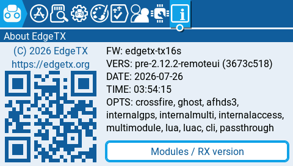

# 0005. Захоплення екрана: гачок, RLE, транспорт у симуляторі

- **Створено:** 2026-07-26
- **Етап:** 1 (пункт 1.4)
- **Статус:** нова
- **Виконавець:** сесія команди + `edgetx-firmware`, перед комітами — `code-reviewer`

## Мета

Побачити екран симулятора з іншої програми. Не намальований, не схожий —
той самий, переданий нашим протоколом.

Це перша задача, у якій ми **торкаємось чужого коду**. Досі все жило в
окремому каталозі; тепер з'являється перший гачок у файлі EdgeTX, а разом із
ним — питання, як наш код взагалі потрапляє в чуже дерево і як він звідти
прибирається.

## Спосіб захоплення — вирішено, не переобговорюється

Гачок `remoteUiOnFlush` у `flushLcd()` (`gui/colorlcd/lcd.cpp`), на самому
початку функції. Звідти приходять прямокутник (`rect_t` — тип EdgeTX),
пікселі цієї області й ознака кінця кадру.

Порівняння двох кадрових буферів **скасовано 2026-07-26**: на TX16S воно не
працює. Розбір — `docs/02-architecture.md`, розділ про захоплення екрана.
Повертатися до цього не треба.

## Критерії приймання

### Механізм вбудовування — вирішити перш за все

Досі наш код лежав окремо й ні з чим не змішувався. Тепер треба спосіб
занести його в дерево EdgeTX так, щоб оновлення EdgeTX не перетворювалося
на біль.

- [ ] Вирішено й записано в `state/DECISIONS.md`, **як** наш код потрапляє в
      `upstream/edgetx`: патч-файл, копіювання скриптом, символьні посилання
      чи щось інше. Записати, які варіанти розглядались і чому обрано цей.
- [ ] Є **дві команди**: застосувати і скасувати. Після скасування
      `git -C upstream/edgetx status --short` **порожній**.
- [ ] Патч гачка лежить окремим файлом у `firmware/edgetx-patch/patches/`,
      придатний до застосування на чистий тег `v2.12.2`.
- [ ] Перевірено, що після скасування й повторного застосування все
      збирається так само. Не «має працювати», а зроблено двічі.

### Гачок

- [ ] **Рівно один** виклик у `gui/colorlcd/lcd.cpp`, на початку `flushLcd()`,
      під `#if defined(REMOTE_UI)`. Жодного іншого файлу EdgeTX не змінено —
      крім підключення нашої бібліотеки в `radio/src/CMakeLists.txt`
      (пункт 8 з `docs/05-hooks.md`).
- [ ] Кожен змінений рядок звірено з `docs/05-hooks.md`. Виходу за перелік
      немає. Якщо виявиться, що потрібне щось поза переліком — **зупинитись
      і сказати**, а не додавати.
- [ ] **Два коміти**, як вимагає `CLAUDE.md`: A — тільки нові файли,
      B — тільки гачки. Не змішувати.
- [ ] Збірка симулятора **без** `REMOTE_UI` дає той самий результат, що й до
      наших змін: жодного зайвого байта, жодної зміни поведінки.

### Захоплення

- [ ] Область із гачка ріжеться на плитки й ставиться в чергу.
- [ ] У самому гачку — **тільки** копіювання й запис у чергу. Ніякого
      стиснення, передачі, DMA чи очікувань: гачок працює в задачі з
      найнижчим пріоритетом, яку витісняє мікшер.
- [ ] Нуль динамічної пам'яті. Усі буфери статичні, розміри — константи.
- [ ] **Переповнення черги не втрачає зміни мовчки.** Якщо місця немає,
      плитка лишається позначеною брудною і піде наступним разом. Доказ —
      тест, а не запевнення.
- [ ] Нуль специфіки TX16S: роздільність береться з `LCD_W`/`LCD_H`.

### Стиснення RLE16

- [ ] Кодувальник за `docs/03-protocol.md`: пари `[лічильник:1][піксель:2]`,
      лічильник 1…255.
- [ ] **Якщо стиснуте вийшло більшим за сире — шлемо сире** (метод 0 у полі
      `метод` пакета `TILE`). Інакше однорідний шум роздує трафік удвічі.
- [ ] Юніт-тести на кодувальник, у тому ж стилі, що й у задачі 0004:
      туди-назад, порожня плитка, плитка з одного кольору, плитка без жодного
      повтору, межа лічильника 255.
- [ ] **Заміряно на справжніх екранах**, не на синтетиці: у скільки разів
      стискається головний екран, меню, екран налаштувань. Числа в результат.

### Транспорт у симуляторі

- [ ] TCP-сокет замість UART. Порт задається, значення за замовчуванням
      записане.
- [ ] При підключенні клієнта пульт шле `HELLO`, далі `TILE` і `FRAME_END`.
- [ ] Скид декодувальника за тишею в каналі — саме той обов'язок
      транспортного шару, що записаний у `docs/03-protocol.md`. Значення
      тайм-ауту обрати й записати.
- [ ] Відключення клієнта не ламає симулятор: він працює далі, просто нікуди
      не шле.

### Доказ, що воно справді працює

- [ ] `tools/capture_check.py` — підключається, розбирає пакети, збирає кадр,
      зберігає **PNG**. Не GUI (це крок 1.5), просто файл.
- [ ] На знімку **видно інтерфейс EdgeTX**, і він збігається з тим, що в
      вікні симулятора. Знімок покласти в `docs/img/`.
- [ ] Заміри в результат: скільки байтів іде на типову дію (прокрутка меню,
      відкриття екрана налаштувань), у скільки разів стиснуло, скільки кадрів
      за секунду виходить.
- [ ] Симулятор із патчем показує на екрані About суфікс **`-remoteui`**
      (рішення задачі 0004) — доказ, що ми дивимось на пропатчену збірку, а не
      на чисту.

## Обмеження

- Дозволені файли поза `remote_ui/`: **тільки** гачок №5 і підключення
  бібліотеки (пункт 8) з `docs/05-hooks.md`. Більше нічого.
- Не братися за емуляцію вводу — це крок 1.6, окрема задача.
- Не робити графічний клієнт — це крок 1.5. Тут достатньо PNG.
- Не міняти формат пакетів у `docs/03-protocol.md`. Знайшлася неточність —
  описати в результаті, специфікацію веде асистент.
- Пульт не чіпати взагалі. Уся задача робиться в симуляторі.
- Назви змінних, функцій і типів — англійською. Коментарі — українською.
- `code-reviewer` перед **кожним** із двох комітів.

---

## Результат

**Виконано 2026-07-26.** Екран симулятора видно в іншій програмі — той самий,
переданий нашим протоколом.



Це не знімок вікна: PNG зібраний із пакетів `TILE`, які прийшли по TCP.
`VERS: pre-2.12.2-remoteui` на ньому — доказ, що дивимось на пропатчену
збірку. Обидва факти в одній картинці.

### Механізм вбудовування

**Symlink на наш каталог + патч-файл на гачки.** Розглядались три варіанти:

| Варіант | Чому не він |
|---|---|
| Копіювання скриптом | у дереві EdgeTX з'являється другий примірник коду; рано чи пізно правлять саме його, а потім втрачають при `revert` |
| Увесь наш код у патчі | означає редагувати патч замість коду: без збірки тестів, без нормального `git diff` |
| **Symlink + патч на гачки** | ✅ примірник коду один (у git цього репозиторію), збірка бачить правки одразу; патч потрібен лише для 14 рядків у двох чужих файлах |

```sh
tools/patch-apply.sh     # symlink + hooks.patch
tools/patch-revert.sh    # назад; сам перевіряє, що дерево EdgeTX чисте
tools/patch-update.sh    # зняти правлені в upstream гачки назад у патч
```

Третій скрипт з'явився не для краси: гачок зручно правити прямо в
`upstream/edgetx`, і без способу «зняти правку назад» вона зникла б при
першому ж `revert`. Тому `patch-revert.sh` **відмовляється** працювати, якщо
дерево змінене не так, як описує патч.

`patch-update.sh` тримає в собі закритий перелік дозволених файлів
(`docs/05-hooks.md`) і не дасть знятися патчу, у якому є щось стороннє —
включно з новим файлом, покладеним у чуже дерево.

**Перевірено двічі, як вимагала задача:**

```
apply  → build (Built target simu) → revert → git status --short порожній
       → apply → build (Built target simu) → revert → порожній → apply → build
```

Каталог `radio/src/remote_ui` вписано в `.git/info/exclude` дерева EdgeTX —
інакше symlink висів би в `git status` невідстежуваним і ховав справжні зміни.
`patch-revert.sh` прибирає і цей рядок.

### Гачок: два файли, 14 рядків

| Файл EdgeTX | Що саме | Пункт `05-hooks.md` |
|---|---|---|
| `radio/src/gui/colorlcd/lcd.cpp` | `#include` (3 рядки) + виклик `remoteUiOnFlush()` на початку `flushLcd()` (5 рядків) | 5 |
| `radio/src/CMakeLists.txt` | `option(REMOTE_UI …)` (1) + `add_subdirectory` під `if(REMOTE_UI)` (5) | 8 |

**Доказ, що без `REMOTE_UI` не змінилось нічого:** препроцесований `lcd.cpp`
із патчем і без патча — **побайтово однакові**, 777 250 байтів, `diff`
порожній (тими самими прапорцями, що й у справжній збірці, з
`compile_commands.json`). Плюс збірка з `-DREMOTE_UI=OFF` проходить і містить
**нуль** символів `remote_ui::`.

Перед тим, як торкатися чужого коду, план перевірив `edgetx-firmware`. Він
підтвердив по коду 2.12.2: `flushLcd` — єдина точка, крізь яку на TX16S
проходять усі змінені області; `lv_color_t` тут справді RGB565 і пікселі
щільні; `lv_disp_flush_is_last()` — чистий геттер, і кликати його треба саме
до `lv_disp_flush_ready()`.

### Як це працює

```
LVGL → flushLcd() → remoteUiOnFlush()      menusTask, найнижчий пріоритет
                       │  memcpy у тіньовий кадр + біти «брудна»
                       ▼
                 бітова карта 135 плиток
                       │  окремий потік
                       ▼
          captureTakeTile → RLE16 → encodeFrame → TCP
```

У гачку — **тільки** копіювання й підняття бітів, як вимагала задача.
Черга — бітова карта фіксованого розміру, тому переповнитись не може: якщо
транспорт не встигає, плитка лишається брудною й піде наступним проходом.
Доказ — тест `CaptureKeepsTilesDirtyWhenTransportIsSlow`, а не запевнення.

Без м'ютекса: гачок пише пікселі, **тоді** біт (release); транспорт знімає
біт, **тоді** читає пікселі (acquire). Найгірше, що може статись, — плитка,
зшита з двох кадрів, яку наступний прохід замінить цілісною.

**Межа цієї гарантії знайдена рецензією і закрита:** плитка, вже забрана
транспортом, живе поза картою, тому додано `captureReturnTile()` — транспорт
повертає її, якщо відправити не вдалося. Без цього правило зворотного тиску
з `docs/02-architecture.md` не було б чим виконати на етапі 2.

### Заміри на справжніх екранах

Повний екран, 480×272 = 261 120 байтів сирих пікселів:

| Екран | На дроті | Стиснення | Сирих плиток |
|---|---|---|---|
| Попередження THROTTLE (майже однотонний) | 17 526 Б | **14.9×** | 0 |
| Системне меню, вкладка Apps | 59 604 Б | 4.38× | 0 |
| About EdgeTX | 59 979 Б | 4.35× | 0 |
| Налаштування, вкладка Hardware | 37 911 Б | 6.89× | 0 |
| Головний екран (фотографічна тема) | 95 190 Б | **2.74×** | **3** |

Три сирі плитки на головному екрані — це правило «стиснуте більше за сире →
шлемо сире», спрацьоване на живому матеріалі, а не в тесті.

Приріст на дію (натиск клавіші в меню, без першого повного кадру):

| Дія | Плиток на дію | Байтів на дію | Стиснення |
|---|---|---|---|
| Навігація в налаштуваннях, 7 дій | 41 | ~10.4 КБ | 7.64× |
| Прокрутка меню Apps, 8 дій | 34 | ~16.2 КБ | 4.28× |

**Що з цього випливає для заліза.** На 921600 бод канал дає ~92 КБ/с:

- типова дія (10–16 КБ) → 0.11–0.18 с, тобто **6–9 дій за секунду**;
- повний фотографічний екран (95 КБ) → **близько секунди**.

Тобто висновок `docs/03-protocol.md` підтверджується: вузьке місце — не
канал, а повні перемальовки. Числа в документі (3–8 КБ на прокрутку) виявились
оптимістичними приблизно вдвічі — LVGL інвалідує більше, ніж здається, а сітка
32×32 округлює це вгору.

### Що зроблено ще

- **`tools/capture_check.py`** — без сторонніх бібліотек (PNG пишеться через
  `zlib`). Розбирає пакети, збирає кадр, зберігає PNG, рахує трафік окремо для
  першого кадру й для приросту. Його CRC звірено з контрольним вектором зі
  специфікації: порожній `PING` = `E7 7E 86 00 00 66 45`.
- **`HELLO` віддає справжнє залізо**, не константи: `tx16s`, `480x272`,
  формат 1, прапорці `0x03` (сенсор + енкодер), 6 тримерів, 7 клавіш із
  назвами (`RTN`, `Enter`, `PAGE<`, `PAGE>`, `MDL`, `TELE`, `SYS`) — усе з
  `keysGetSupported()` / `keysGetLabel()`.
- **42 тести** (було 21), `-Wall -Wextra` без попереджень, ASan/UBSan чисто,
  нуль виділень динамічної пам'яті.
- **Нуль специфіки TX16S доведено збіркою:** ті самі 42 тести проходять на
  320×240, 480×320 і 800×480 — сітка плиток перераховується сама.
- **Відключення клієнта симулятор переживає:** підключення й розриви в логу,
  процес живий, наступний клієнт отримує `HELLO` і повний екран.

### Дві рецензії `code-reviewer`

Перша дала 17 знахідок, з них чотири блокери. Найважливіша: **тіньовий кадр
лежав у `.bss`, а це 261 120 байтів при 192 КБ внутрішньої ОЗП STM32F429** —
прошивка для пульта просто не злінкувалась би. Виправлено розміщенням у SDRAM
(`__SDRAM`), як робить сам EdgeTX зі своїми кадровими буферами.

Друга рецензія перевіряла правки й знайшла **три нові дефекти, внесені самими
правками** — зокрема потенційне подвійне закриття дескриптора й те, що
деструктор не чекав на потік, тобто закривав проблему лише наполовину. Усі
три виправлено.

Повний перелік — в історії комітів; тут перелічено те, що змінило поведінку:
розміщення в SDRAM, `static_assert` на безблокувальність atomic,
`captureReturnTile()`, зупинка потоку з `pthread_join`, `FRAME_END` більше не
чекає спорожніння черги, `#error` на ЧБ-цілі, очищення тіньового кадру при
першому флеші (секція `.sdram` — `NOLOAD`, її ніхто не обнуляє).

### Коміти

| Коміт | Що в ньому |
|---|---|
| `498fcfb` | **A** — тільки наші файли: захоплення, RLE16, транспорт, `HELLO`, тести, клієнт-перевірка |
| `2b5068e` | **B** — тільки гачки: `hooks.patch` і три скрипти механізму |

---

## Знахідки для асистента

Нічого з цього я не правив сам: усе — у документах, які веде асистент.

### 1. ⚠️ Місце гачка правильне для TX16S, але не для решти кольорових цілей

Обидва агенти (`edgetx-firmware` і `code-reviewer`) незалежно дійшли одного
висновку, читаючи `lv_refr.c`:

- на **TX16S** блок раннього виходу в `flushLcd` **не компілюється взагалі**
  (`LCD_VERTICAL_INVERT` → `direct_mode = 0`), тому питання «до чи після» для
  нас не стоїть — усе працює як задумано;
- на цілях із **прямим режимом** (T18, X12S, V16) LVGL виставляє область у
  **весь екран** на кожному флеші. Гачок перед раннім виходом зробить там
  `memcpy` цілого екрана й позначить брудними всі 135 плиток по кілька разів
  на кадр — у задачі з найнижчим пріоритетом.

Тобто обґрунтування в `docs/05-hooks.md` («гачок після раннього виходу
працював би на TX16S і мовчав би на решті») **перевернуте**: він там не
мовчав би, а працював би дешевше — раз на кадр, уже з повним кадром.

Гачок лишено там, де велить документ. Місце гачка — рішення асистента, і
воно впирається в крок 1.7 (перевірка інших цілей). Варіанти: лишити як є,
перенести після раннього виходу, або пропускати не-останні флеші за
прапорцем цілі.

### 2. Неточності в `docs/05-hooks.md`

- **пункт 5** не згадує рядок `#include "remote_ui/remote_ui.h"`, тому
  «3 рядки в `lcd.cpp`» насправді 8;
- **пункт 5** описує сигнатуру `remoteUiOnFlush(area, color_p, …)` з типами
  LVGL. Ми передаємо чотири координати й `const uint16_t*`, щоб наша
  бібліотека не залежала від LVGL узагалі (правило 3 з `CLAUDE.md`). Виклик
  лишився одним, місце — тим самим;
- **пункт 8** обіцяє опцію в `radio/cmake/…` — **такого каталогу в 2.12.2
  немає**. `option(REMOTE_UI …)` покладено в `radio/src/CMakeLists.txt` поряд
  з іншими опціями;
- підсумкова таблиця «~34 рядки в 9 файлах» тепер має факт для двох із них:
  8 + 6 = 14 рядків.

### 3. Неточності в `docs/03-protocol.md`

- **поле версії в `HELLO` — 16 байтів — замале.** Повний рядок EdgeTX
  (`pre-2.12.2-remoteui`) — 19 символів. Ми віддаємо `VERSION VERSION_SUFFIX`
  = `2.12.2-remoteui`, рівно 15 + нуль. Якщо суфікс колись буде довший,
  почнеться мовчазне обрізання. Пропозиція: розширити поле до 24 або 32;
- **`FRAME_END` тепер розходиться з формулюванням.** Документ каже «кадр
  цілісний, можна показувати». Ми шлемо `FRAME_END`, щойно лічильник кадрів
  змінився, навіть якщо брудні плитки лишились, — інакше під час прокрутки
  меню клієнт показував би застиглу картинку саме в русі. Формулювання варто
  послабити до «точка показу»;
- оцінка трафіку в кінці документа занижена приблизно вдвічі — див. заміри.

### 4. Неточність у `docs/02-architecture.md`

«Наші десятки мікросекунд на цьому фоні — шум» — для **повної** перемальовки
це `memcpy` на 261 КБ по SDRAM, тобто одиниці мілісекунд, а не десятки
мікросекунд. Для часткових областей оцінка правильна. Заміряти на залізі —
етап 2.

### 5. Записано в журнал рішень

Тайм-аут скиду декодувальника (**100 мс тиші**) — це закриває відкрите
питання з `PROGRESS.md`, розділ «Перевірити пізніше».

---

## Рецензія

*(заповнює асистент)*
