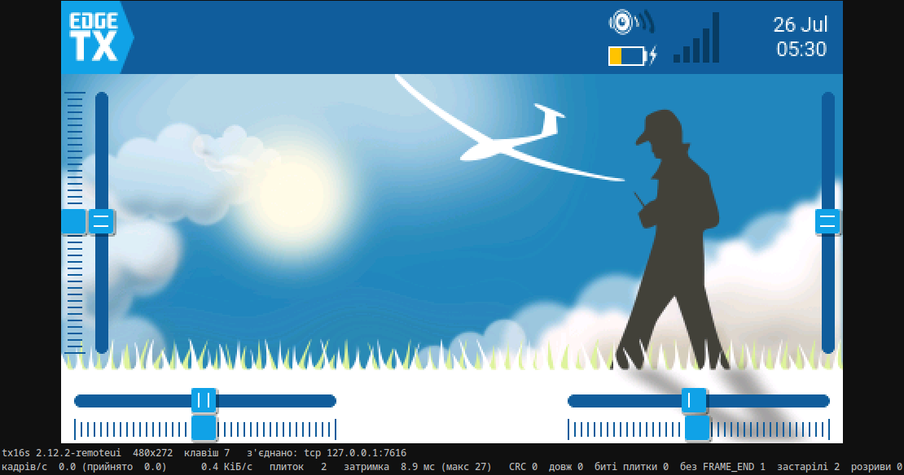
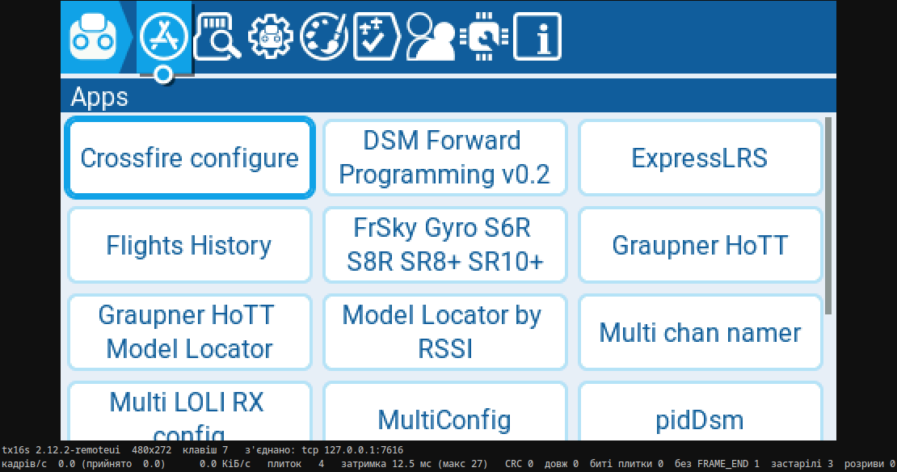
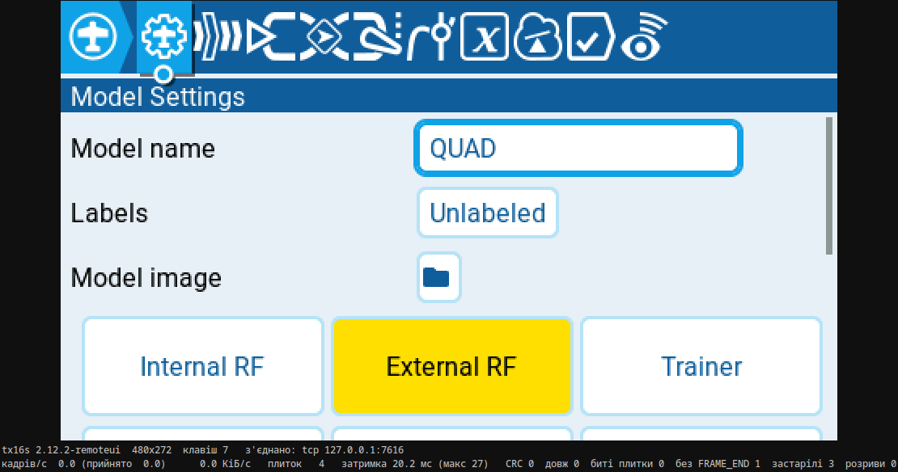
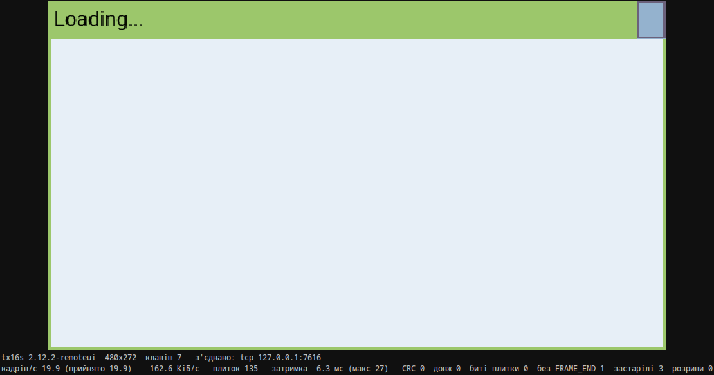
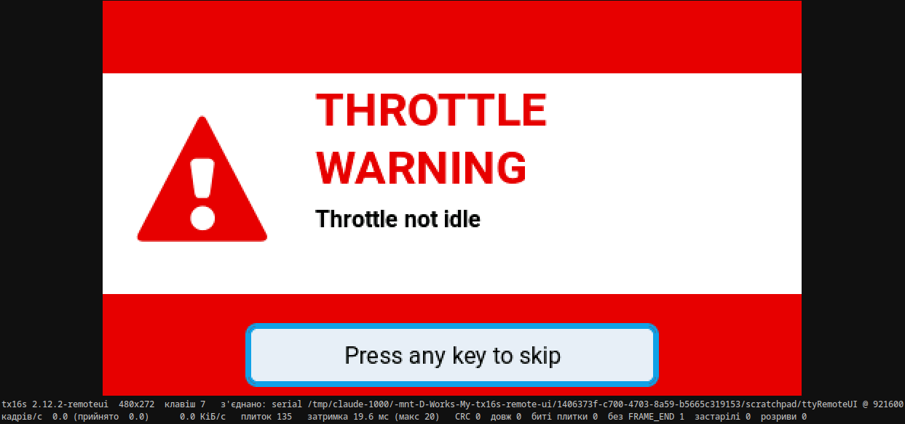
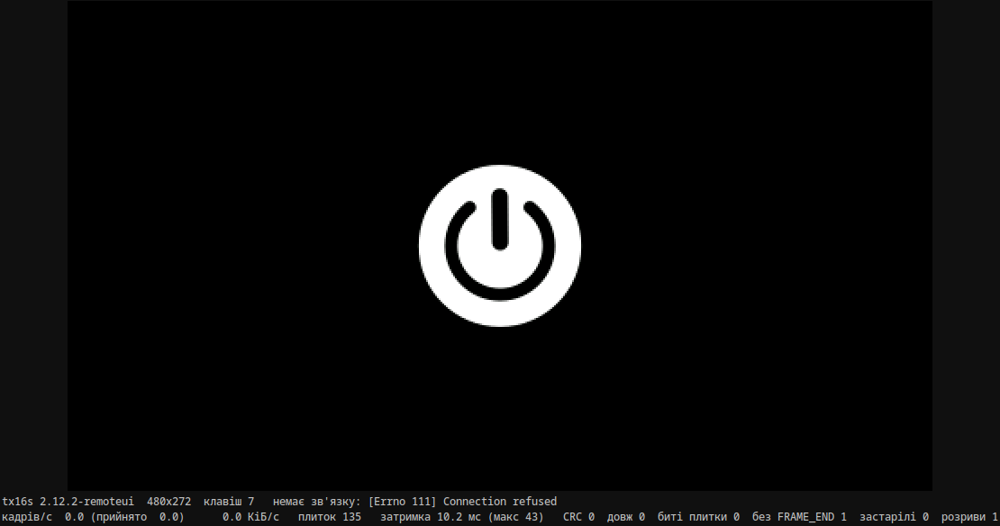
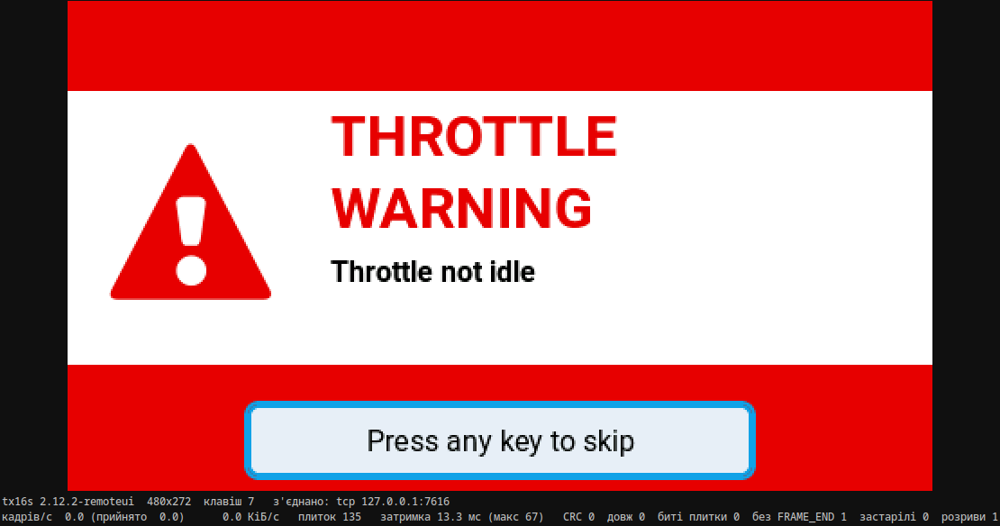

# 0006. Тестовий клієнт: вікно з екраном пульта

- **Створено:** 2026-07-26
- **Етап:** 1 (пункт 1.5)
- **Статус:** прийнято 2026-07-26
- **Виконавець:** сесія команди, `webui-dev` за потреби

## Мета

Бачити екран пульта у вікні **живцем**, а не збирати PNG після факту.
Відкрив меню в симуляторі — воно з'явилося у вікні клієнта.

Це діагностичний інструмент, а не продукт. Справжній клієнт — у браузері,
він робиться на етапі 2. Тому вилизувати тут нема чого: аби працювало,
показувало числа й не заважало.

## Чому це важливіше, ніж здається

Досі ми дивилися на статичні знімки. Вікно покаже те, чого знімок показати не
може: **як воно поводиться в русі**. Чи не блимає, чи не рветься кадр, чи не
накопичується затримка, чи не сиплються плитки при швидкій прокрутці.
Половина дефектів захоплення видно тільки так.

## Критерії приймання

### Клієнт

- [ ] `tools/test_client.py` — вікно, у якому екран пульта оновлюється в
      реальному часі.
- [ ] **Розмір і формат беруться з `HELLO`**, а не зашиті числами. 480×272 у
      коді — це помилка, навіть якщо зараз працює: на кроці 1.7 ми зберемо
      симулятор для інших пультів, і клієнт має підхопити їх без правок.
- [ ] Розбираються обидва методи `TILE` — сирий і RLE16.
- [ ] Малюємо в позаекранний буфер, показуємо на `FRAME_END`. Не раніше:
      інакше користувач бачитиме напівнамальований кадр.
- [ ] Невідомі типи пакетів **мовчки ігноруються** — правило сумісності з
      `docs/03-protocol.md`. Перевірити тестом, а не оком.
- [ ] `PING` раз на 2 с; 5 с без відповіді = розрив. Після відновлення
      зв'язку клієнт обов'язково шле `REFRESH`.
- [ ] Розрив, перезапуск симулятора й повторне підключення не валять клієнт:
      він чекає й підключається сам.

### Транспорт — змінний, і це не на майбутнє

- [ ] TCP і **послідовний порт** за одним інтерфейсом, вибір прапорцем
      командного рядка.
- [ ] Причина: на кроці 2.4 план передбачає **той самий клієнт** через
      перетворювач USB-UART. Якщо закласти лише TCP, на залізі доведеться
      переписувати клієнт саме тоді, коли навколо все й так нове й ненадійне.
- [ ] Послідовний шлях перевірити хоча б на заглушці — `tools/uart_loopback.py`
      у репозиторії вже є.

### Звірка з прошивкою

- [ ] Розбір кадру й RLE16 у Python **звірено з еталонними векторами** з
      задачі 0004: порожній `PING` = `E7 7E 86 00 00 66 45`. Дві незалежні
      реалізації протоколу мають сходитись на однакових байтах, інакше сенсу
      в специфікації немає.
- [ ] Помилки CRC не валять клієнт: пакет викидається, лічильник росте.

### Що показувати на екрані

- [ ] Кадрів за секунду, кілобайтів за секунду, кількість плиток у кадрі,
      лічильник помилок CRC. У вікні або поруч у консолі — на вибір.
- [ ] Ці числа знадобляться на кроці 2.5 для замірів на залізі, тож нехай
      будуть одразу.

### Доказ

- [ ] Знімки вікна клієнта: головний екран, системне меню, налаштування
      моделі. У `docs/img/client/`.
- [ ] **Сценарій, наближений до критерію виходу з етапу:** відкрити в
      симуляторі меню Lua-скрипта (ELRS-конфігуратор із нашої картки) і
      побачити його у вікні клієнта. Знімок додати.
- [ ] Описати в результаті, як воно **поводиться в русі**: чи є блимання,
      рвані кадри, накопичення затримки при швидкій прокрутці. Це головна
      причина, чому вікно, а не PNG — тож спостереження за поведінкою цінніші
      за самі знімки.

## Обмеження

- **Ввід не робити.** Клавіші, енкодер і сенсор — це крок 1.6, окрема задача.
  Клієнт поки що тільки дивиться.
- Жодного файлу EdgeTX не чіпати. Патч лишається таким, як є.
- Не міняти протокол. Знайшлася неточність — описати в результаті.
- Залежностей — мінімум, кожну записати з командою встановлення. Стандартна
  бібліотека краща за пакет; пакет краще за два.
- Не робити з цього продукт: без налаштувань, тем, збереження стану. Одне
  вікно, одні числа.
- Код українською в коментарях, назви — англійською.

---

## Результат

**Виконано 2026-07-26.** Екран симулятора видно у вікні живцем: відкрив меню —
воно з'явилося в клієнті через 40–50 мс. Прокрутка не блимає, кадр не рветься,
затримка не накопичується — числа нижче.

### Що з'явилося

| Файл | Що це |
|---|---|
| `tools/test_client.py` | вікно з екраном пульта, tkinter, ~380 рядків |
| `tools/remote_ui_proto.py` | протокол на боці ПК: CRC, кадрування, HELLO, RLE16, транспорти |
| `tools/proto_test.py` | 29 тестів: еталонні вектори, кадрування, сесія, транспорти |

`tools/capture_check.py` переведено на спільний модуль — свій примірник
розбору він більше не тримає. Перевірено після переносу: ті самі 135 плиток,
стиснення 14.90×, як і до нього.

```sh
tools/test_client.py                        # tcp 127.0.0.1:7616
tools/test_client.py --scale 2              # ціле збільшення
tools/test_client.py --serial /dev/ttyUSB0 --baud 921600
tools/test_client.py --serial socket://127.0.0.1:7616   # без заліза
python3 tools/proto_test.py                 # тести
```

Залежності: `tkinter` зі стандартної бібліотеки (на Arch це пакет `tk`,
`sudo pacman -S tk`) і **нічого більше** для TCP. Для `--serial` потрібен
`pyserial` (`sudo pacman -S python-pyserial`). Обидва в системі вже стояли.
Картинка малюється через `tk.PhotoImage(data=…)` у форматі PPM — 3.5 мс на
кадр 480×272, тобто вікно не є вузьким місцем.

### Звірка з прошивкою

Розбір звірено з еталонними векторами задачі 0004 — числа взяті з
`test/test_protocol.cpp` і `test/test_rle16.cpp`, тобто з іншої реалізації, а
не з нашого ж коду:

| Вектор | Очікувано | Збіг |
|---|---|---|
| порожній `PING` | `E7 7E 86 00 00 66 45` | ✅ |
| `HELLO` з одним байтом `AA` | `E7 7E 01 01 00 AA E4 D1` | ✅ |
| CRC-16/CCITT-FALSE("123456789") | `0x29B1` | ✅ |
| RLE: 1024 × `0xF81F` | 15 Б, `[255,1F,F8]×4 + [4,1F,F8]` | ✅ |
| RLE: 300 × `0x1234` | 6 Б, лічильники 255 і 45 | ✅ |
| `MAX_PAYLOAD` / `FRAME_OVERHEAD` | 4096 / 7 | ✅ |

Решта тестів: розбір побайтово і шматками по 3 і 7 байтів; сміття перед
маркером; маркер **усередині** даних; битий CRC (наступний пакет виживає);
брехлива довжина `0xFFFF` (ресинхронізація з наступного байта, окремий
лічильник, не CRC); `reset()` після тиші. Помилки CRC не валять клієнт —
пакет викидається, лічильник у вікні росте.

**Невідомі типи пакетів** перевірено тестом, а не оком
(`test_unknown_packet_types_are_ignored`): між плитками подаються типи `0x7F`,
`0xF0`, `0x42` — кадр збирається правильно, лічильник невідомих = 3, биті
плитки = 0.

**Розмір береться з `HELLO`.** Тест будує синтетичний `HELLO` на 320×240 і на
800×480 і перевіряє, що буфер саме такий; числа 480×272 у клієнті немає взагалі.
Формат пікселя теж читається: якщо він не RGB565 (ЧБ-пульт, етап 5.3), клієнт
каже про це в консоль, а не малює сміття.

### Транспорт

TCP і послідовний порт — за одним інтерфейсом (`recv` / `send` / `close`,
`None` = розрив), вибір прапорцем. Послідовний відкривається через
`serial_for_url`, тому приймає і `/dev/ttyUSB0`, і `/dev/pts/7`, і `socket://`.

Перевірено **не на словах**: `socat pty,raw,echo=0,link=…/ttyRemoteUI
tcp:127.0.0.1:7616` робить із TCP-порту симулятора справжній tty, і клієнт
через `--serial` показує ту саму картинку (знімок 05). Під час швидкої
прокрутки через pty: **204.8 КіБ/с, 105 плиток у кадрі, 15.8 кадрів/с, CRC 0,
битих плиток 0**. `PING` → `HELLO` відповідає миттєво, `loop://` pyserial
покритий тестом.

### Як воно поводиться в русі

Заміри — на сторінці «Model Settings», клавіші подаються адресно у вікно
симулятора, годинник спільний для клавіш і для потоку.

| Сценарій | Натискань | Кадрів | КіБ/с | Реакція, медіана / макс | Хвіст |
|---|---|---|---|---|---|
| повільна прокрутка (3.5/с) | 10 | 10 | 33.4 | 47 / 61 мс | 44 мс |
| швидка прокрутка (12.9/с) | 15 | 15 | 150.3 | 48 / 90 мс | 36 мс |
| дуже швидка (20.4/с) | 20 | 20 | 229.9 | 37 / 63 мс | 31 мс |

«Реакція» — від натискання до кадру, у якому зміна вже є. «Хвіст» — скільки
ще йшли дані після **останнього** натискання.

- **Затримка не накопичується.** Хвіст 31–44 мс на будь-якій швидкості: коли
  людина відпустила клавішу, картинка вже приїхала. Кількість кадрів завжди
  дорівнює кількості натискань — зайвих перемальовок протокол не додає.
- **Плиток у кадрі:** медіана 33, максимум 105 (це коли сторінка меню
  прокручується цілком, а не рухається лише курсор).

**Чи блимає і чи рветься кадр** — перевірено записом вікна клієнта на 60 к/с
(`ffmpeg -f x11grab`) і покадровим порівнянням:

- Швидка прокрутка, 60 натискань за 3.6 с: рівно **60 змін зображення**, жодної
  зайвої, жодної пропущеної.
- Повільна прокрутка, 6 натискань по 0.5 с: кожна зміна вкладається **в один
  кадр відео** (16 мс). Одна з них зачепила 70 % екрана — і все одно приїхала
  цілою.
- Перемикання сторінок меню (зміна 96 % екрана, ~18 КБ): 4 перемикання —
  4 зміни, кожна атомарна в межах 16 мс. Один раз через 67 мс домалювалась
  ділянка на 12 % — це друга перемальовка самого EdgeTX, а не рвана передача.
- **Блимання немає:** проміжних порожніх або напівнамальованих станів у 720
  знятих кадрах не знайдено. Правило «малюємо в позаекранний буфер, показуємо
  на `FRAME_END`» тримається.

Чому не рветься, хоча `FRAME_END` навмисно не чекає спорожніння черги: на
петлі транспорт устигає віддати всі 135 плиток за один прохід циклу, тому
`FRAME_END` приходить уже після них. **На залізі так не буде** — див. нижче.

**Найважче, що бачив клієнт** — екран «Loading…» Lua-скрипта ExpressLRS:
скрипт перемальовує весь екран ~20 разів на секунду, і це дає **162.6 КіБ/с
при 135 плитках у кадрі** (знімок 04). Клієнт тримає без втрат.

**Власна затримка вікна** (від приходу `FRAME_END` до показу): 5–25 мс,
типово ~10. Це період опитування черги (15 мс), а не робота розбору.

### Що це означає для заліза (крок 2.4–2.5)

921600 бод 8N1 — це **90 КіБ/с**. Виміряні 230 КіБ/с при 20 діях за секунду і
162 КіБ/с на ELRS-скрипті — це **у 1.8–2.5 раза більше**, ніж канал. Тобто на
залізі вузьким місцем стане саме дріт, і поводитись воно буде так: бітова
карта брудних плиток злипатиметься, кадрів на секунду стане менше, а картинка
відставатиме приблизно на час передачі одного кадру. Оцінка «6–9 дій за
секунду» із задачі 0005 підтверджується з іншого боку. Заразом: на залізі
великий кадр **поїде частинами** — те, чого на петлі не видно, бо там усе
встигає за один прохід.

### Знахідки

**1. `REFRESH` на нерухомому екрані не дає `FRAME_END`.** Прошивка шле
`FRAME_END` лише коли зріс лічильник кадрів захоплення
(`transport_simu.cpp`), а `REFRESH` лічильник не рухає — він лише позначає
плитки брудними. У симуляторі по TCP це сховано: при підключенні
`lastFrameSent` навмисно ставиться на «мінус один», і один `FRAME_END`
вилітає примусово. **На каналі без поняття «підключився» (UART, крок 2.4)
чесний клієнт після `REFRESH` отримає 135 плиток і жодного `FRAME_END`** —
і, дотримуючись специфікації, не покаже нічого, доки пульт сам щось не
перемалює. Знайдено саме на послідовному шляху, за TCP не було видно.

Протокол не чіпав (обмеження задачі). У клієнті стоїть запобіжник: якщо
плитки прийшли, а `FRAME_END` не прийшов протягом 300 мс — кадр показується,
і лічильник **`без FRAME_END`** у вікні росте, щоб дефект було видно, а не
заметено під килим. На знімках 05–07 видно `без FRAME_END 1` — це рівно він.
Рішення, як правити (шлях: `FRAME_END` після відправлення всіх плиток, які
позначив `REFRESH`), — за асистентом.

**2. Порядок вітання має значення, і клієнт мав тут помилку.** Спершу він
слав `REFRESH` одразу після відкриття труби. По TCP це працює: пульт
вітається сам, `HELLO` приходить першим, розмір екрана відомий, плитки є куди
класти. **На послідовному порту клієнт отримав 135 плиток раніше за `HELLO` і
викинув усі** — вікно лишалось порожнім при живому з'єднанні. Правильний
порядок: `PING` → `HELLO` → `REFRESH`. Виправлено, покрито двома тестами з
підробленим транспортом (`Handshake`).

Це рівно те, про що попереджала задача: якби послідовний шлях відкладали до
кроку 2.4, ця помилка виявилася б там, де одночасно нове й залізо, і дріт, і
прошивка.

**3. Симулятор обслуговує одного клієнта за раз** (`accept` у циклі,
черга 1). Другий клієнт мовчки чекає. Не дефект, але збиває з пантелику:
`capture_check.py` при піднятому вікні отримує нуль байтів.

**4. ELRS-скрипт у симуляторі не виходить за «Loading…»** — модуля немає,
питати нікого. Меню Lua-скрипта передається й малюється (це й перевірялось), а
самі параметри конфігуратора з'являться лише на залізі.

### Знімки

Усі — вікно клієнта, `--scale 2`, знято з екрана, а не складено з пакетів
(`docs/img/client/`):

| | |
|---|---|
| Головний екран |  |
| Системне меню, вкладка Apps |  |
| Налаштування моделі |  |
| Меню Lua-скрипта ELRS — 162.6 КіБ/с, 135 плиток у кадрі |  |
| Той самий клієнт через **послідовний порт** (pty від socat) |  |
| Симулятор убито: клієнт живий, тримає останній кадр |  |
| Симулятор піднято: клієнт підключився сам і перемалював екран |  |

Розрив і відновлення (знімки 06–07) — це перевірка вимоги «не валиться, чекає
й підключається сам»: пульт убито `pkill -x simu`, клієнт показав
`немає зв'язку: [Errno 111] Connection refused`, лічильник розривів став 1;
після запуску симулятора підключився без втручання і забрав повний кадр.

### Файли й коміти

Нові:

- `tools/test_client.py`
- `tools/remote_ui_proto.py`
- `tools/proto_test.py`
- `docs/img/client/01…07-*.png`

Змінені:

- `tools/capture_check.py` — власний розбір протоколу замінено на імпорт
  спільного модуля; логіка PNG і лічильників не чіпалась.
- `tasks/INDEX.md`, `state/PROGRESS.md`, `state/DECISIONS.md` — стан.

**Гачків у EdgeTX не додавалось і не змінювалось.** `firmware/**` не чіпався
взагалі.

Коміти: `68b6c52` — клієнт, спільний модуль, тести, знімки. Цей результат і
стан ідуть наступним комітом (`docs: результат задачі 0006 …`).

### Відхилення від задачі

1. **Файлів вийшло три, а не один.** Задача називала `tools/test_client.py`.
   Розбір протоколу винесено в `tools/remote_ui_proto.py`, тести — в
   `tools/proto_test.py`, а `capture_check.py` переведено на спільний модуль.
   Причина: інакше в `tools/` жили б два примірники декодувальника, і
   «звірка з еталонними векторами» перевіряла б лише один із них. Обидва
   інструменти тепер розбирають кадри тим самим кодом.
2. **Клієнт показує кадр і без `FRAME_END`** — через 300 мс тиші після
   плиток. Це відступ від критерію «показуємо на `FRAME_END`, не раніше», і
   зроблений він свідомо: без нього послідовний шлях показує порожнє вікно
   (знахідка 1). Напівнамальованого кадру це не дає — 300 мс на порядок
   більше за час передачі найбільшого кадру. Кожен такий показ лічиться
   окремо і видно у вікні.
3. Числа виводяться **у вікні** (задача дозволяла вікно або консоль).

### Що не вийшло

Усі критерії задачі закриті. Незакритого немає; те, чого немає нижче, — це
свідомі межі задачі, а не борг.

### Чого немає

- **Вводу немає** — це крок 1.6, як і домовлялись. Клієнт тільки дивиться.
- Жодного файлу EdgeTX не змінено; `git -C upstream/edgetx status --short`
  показує ті самі два файли з гачками, що й до задачі.
- ЧБ-пульти (`MONO1`) не малюються — етап 5.3. Клієнт про це попереджає.
- Клавіші з `HELLO` читаються й показуються числом у рядку стану, але панелей
  з них не будується — це етап 3.

### Дрібниця для наступних сесій

Симулятор під SDL2 приймає синтетичні клавіші (`XSendEvent`) **лише коли його
вікно має фокус вводу** — інакше події доходять і мовчки викидаються. У
скриптах автоматизації перед подачею клавіш треба робити
`win.set_input_focus(...)`. Півгодини пішло на те, щоб це зрозуміти.

---

## Рецензія

**Чим перевірено.** `git log` і `git show --stat` по обох комітах;
`git -C upstream/edgetx status --untracked-files=all`; **власний прогін
`python3 tools/proto_test.py`** — 29 тестів, код виходу 0; `grep` по
`test_client.py` і `remote_ui_proto.py` на зашиті 480/272; перегляд знімка
`04-elrs-script.png`.

| Критерій | Вердикт | Доказ, який бачив рецензент |
|---|---|---|
| Вікно з екраном живцем | ✅ | знімок 04: меню Lua-скрипта ELRS, поруч живі лічильники |
| Розмір із `HELLO`, не зашитий | ✅ | `grep` на `480`/`272` в обох файлах — **жодного збігу**; у рядку стану `480x272` прийшло з пакета |
| Обидва методи `TILE` | ✅ | еталонні вектори RLE16 збігаються з тестами прошивки |
| Невідомі типи ігноруються | ✅ | `test_unknown_packet_types_are_ignored` — прогнав сам |
| Помилки CRC не валять клієнт | ✅ | окремий лічильник у рядку стану, тест на битий CRC проходить |
| Транспорт змінний | ✅ | TCP і послідовний за одним інтерфейсом; перевірено **справжнім tty** через `socat`, не лише на заглушці |
| Звірка з прошивкою | ✅ | `PING` = `E7 7E 86 00 00 66 45`, CRC("123456789") = `0x29B1`, обидва вектори RLE16 — числа взяті з тестів C++, а не з власного коду |
| Числа для кроку 2.5 | ✅ | кадрів/с, КіБ/с, плитки, затримка, CRC, розриви — усе у вікні |
| Поведінка в русі | ✅ | 60 змін на 60 натискань у записі на 60 к/с; хвіст 31–44 мс на будь-якій швидкості — затримка **не накопичується** |
| Чуже дерево не зачеплено | ✅ | ті самі два файли з гачками, нічого нового |
| Ввід не робили | ✅ | у комітах немає ані `KEY`, ані `TOUCH` — межу задачі витримано |

### Дві знахідки — обидві правильно оформлені

**Перша, ваша власна помилка (`REFRESH` до `HELLO`), винесена в результат
відкрито.** Це саме те, чого хочеться від звіту: помилка знайдена, названа,
виправлена, покрита тестом. Показово, що по TCP вона не проявлялася — пульт
вітається сам, — а на послідовному вилізла. Тобто вимога зробити транспорт
змінним **уже зараз** окупилася в тій самій задачі, де її поставили: дефект
спіймано в симуляторі, а не на залізі через два тижні.

**Друга — вада прошивки, і рішення прийнято.**

`REFRESH` на нерухомому екрані не породжував `FRAME_END`, бо той шлеться лише
коли зріс лічильник кадрів. Клієнт отримував усі плитки й **не показував
нічого**.

Це не дрібниця, і виправляти треба в прошивці. Найтиповіший випадок у житті —
людина відкриває телефон, а пульт спокійно стоїть на головному екрані й нічого
не перемальовує. Саме тоді все й ламалося б, і виглядало б як мертвий зв'язок
при живому.

`docs/03-protocol.md` уточнено: **обробка `REFRESH` — це завжди «всі плитки +
`FRAME_END`»**, незалежно від того, чи малював щось LVGL. Виправлення прошивки
йде в наступну задачу.

Запобіжник у клієнті (показ через 300 мс тиші) правильно лишити **як
діагностику** — з лічильником «без FRAME_END» на видноті. Коли прошивку
виправлять, лічильник має стояти на нулі; якщо колись зрушить — це знову вада,
а не «ну воно ж якось показує».

### Про 230 КіБ/с — це головне число задачі

Швидка прокрутка просить 230 КіБ/с, Lua-скрипт 162, а канал на 921600 бод дає
близько 90. **Вузьким місцем стає дріт**, і це варто було дізнатися зараз, а
не на етапі 2.

Відповідь — **плавна деградація, а не гонитва за швидкістю**. Плитка, що не
влізла, лишається брудною і йде наступним кадром: кадри рідшають, але кожен
показаний кадр цілісний. Рвати картинку заради частоти не можна — це саме те,
через що дешеві рішення виглядають зламаними.

2 Мбод повернемось перевіряти на кроці 2.5, і там є нюанс на нашу користь:
стеля 1 Мбод у ADR-0003 стосується перетворювача CP2102 на стенді кроку 2.4.
У готовому виробі його в ланцюзі немає — пульт з'єднаний з мостом дротом
напряму. Тобто це обмеження стенда, а не виробу.

Ще одне, чого не варто забувати при читанні цих чисел: заміряно в симуляторі,
де кадри народжуються так швидко, як дозволяє комп'ютер. На залізі оновлення
інтерфейсу обмежене згори, а задача меню має найнижчий пріоритет. Тобто
реальна потреба може виявитись нижчою. Міряти, не вгадувати.

**Вердикт: прийнято.** Усі критерії закриті доказами, які рецензент відтворив
самостійно. Обидві знахідки оформлені так, як треба: своя помилка названа
відкрито, чужа вада не залатана мовчки, а винесена на рішення.

**Що піде далі:**
1. Крок 1.6 — емуляція вводу. Разом із ним: виправити `FRAME_END` після
   `REFRESH` у прошивці.
2. На крок 2.5 — перевірити 2 Мбод на справжньому мості, без CP2102 у ланцюзі.
