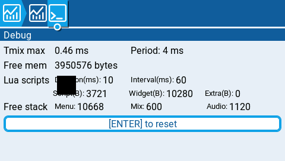
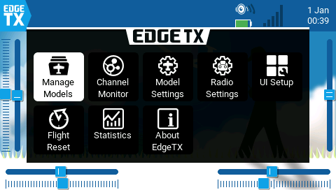
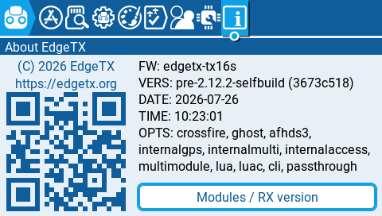

# 0010. Перше прошивання: пульт заговорив по дроту

- **Створено:** 2026-07-26
- **Етап:** 2, кроки 2.3, 2.4, 2.5
- **Статус:** нова
- **Виконавець:** сесія команди **разом із людиною**; `hw-integration`
  обов'язково перед першим фізичним підключенням

## Мета

Побачити справжній екран справжнього пульта на екрані комп'ютера.

Це та задача, заради якої все робилося. Досі все жило в симуляторі.

## ⚠️ Чим ця задача відрізняється від усіх попередніх

**Тут уперше можна щось зламати по-справжньому.** Досі найгіршим наслідком
помилки був упалий процес на ПК. Тепер помилка означає пульт, який не
вмикається, у людини, яка не бачить екрана.

Тому задача побудована як послідовність **контрольних точок**. Після кожної —
зупинка й перевірка, що пульт живий. Не «зробили все, потім подивилися».

Ще одне: **людина не бачить екрана.** Кожен крок мусить мати ознаку успіху,
яку чути або видно на комп'ютері, а не на пульті. Крок без такої ознаки
переписати.

---

## Крок 0. Перевірити шлях назад

**Копію поза диском вирішено не робити** — рішення людини від 2026-07-26,
переобговоренню не підлягає. Обґрунтування записане нижче, воно слушне.

Що робить це рішення безпечним, і чому асистент, наполягаючи п'ять разів,
перебільшував:

- **Прошивку відкату не треба нікуди зберігати.** Пульт зараз на **стоковому
  публічному релізі** EdgeTX 2.12.2 — його можна просто завантажити наново,
  байт у байт. Локальні зліпки в `sd-backups/firmware-original/` тепер зручність,
  а не єдина копія. Плюс наша власна збірка відтворюється з репозиторію.
- **DFU зіпсувати неможливо** — він у ПЗП процесора, не у флеші. Пульт, який
  не вмикається, усе одно з'явиться на USB як `0483:df11`.
- **Копія картки вже існує** (`sd-backups/firstBackup/`, 97 МБ, разом із
  калібруванням у `radio.yml`). Ризик, від якого рятувала б копія на іншому
  диску, — це смерть диска, подія, ніяк не пов'язана з тим, що ми робимо в
  цій задачі.

### ⚠️ Який саме зліпок є еталоном — виправлено 2026-07-26

**У першій редакції цієї задачі був названий не той файл.** Помилка асистента,
знайдена командою на кроці 0 — читанням вмісту, а не назв. Виконана буквально,
вона перетворила б відкат на другий інцидент поверх першого.

| Каталог | Що всередині | Роль |
|---|---|---|
| `sd-backups/firmware-original/` | **2.8.0** + завантажувач 2.7.1, md5 `bab1d2a3…` (усі чотири файли однакові) | історія, **не еталон цієї задачі** |
| `sd-backups/upgrade-2.12.2/dump-after-2.12.2.bin` | **v2.12.2**, md5 `7b6d1ce1…` | ✅ **еталон відкату** |

Чому це важило: пульт зараз на 2.12, і вміст SD-картки прив'язаний до версії.
Заливка `firmware-original/` відкотила б застосунок на 2.8.0 і **зажадала б
повернути ще й картку** (`docs/07-recovery.md:197-199`) — на пульті без екрана,
у момент, коли щось уже пішло не так.

⚠️ **Наша прошивка містить і завантажувач.** Перевірено: у перших 128 КБ
`firmware.bin` лежить `BOOT` і рядок `edgetx-tx16s-pre-2.12.2-selfbuild`.
Тобто заливка замінює й завантажувач (зараз там 2.7.1 — оновлення з картки
його не чіпало). Наслідків для відкату немає: еталонний зліпок накриває весь
флеш і поверне обидві частини. Але знати про це треба.

### Перевірки

- [ ] Еталон на місці й читається: `upgrade-2.12.2/dump-after-2.12.2.bin`,
      2 МБ, md5 `7b6d1ce1e126f13732f080d228917ba7`.
- [ ] ⚠️ **Найсильніша форма перевірки, і робити треба саме її:** зчитати
      пам'ять пульта через DFU і звірити з еталоном **побайтово**. Читання
      нічого не змінює (`docs/07-recovery.md:120`). Так доводиться не «файл
      існує», а «`dfu-util` працює **зараз**, і те, що в пульті, дорівнює тому,
      що ми збираємось повертати». Спосіб запропонувала команда, він кращий за
      написаний тут спочатку.
- [ ] `docs/07-recovery.md` перечитаний **людиною**, не лише агентом.
- [ ] Пульт заряджений. Перерваний запис у флеш — єдиний спосіб зробити
      відновлення справді складним. ⚠️ У режимі DFU рівень батареї не видно, і
      живлення від USB про неї нічого не каже — перевіряє людина.

---

## Крок 1. Прошити — і нічого не налаштовувати

Порядок саме такий, і він обраний навмисно.

Наша прошивка **без налаштування порту поводиться як звичайний EdgeTX**: режим
лишається `NONE`, транспорт не створюється, задача не запускається. Отже
перший крок перевіряє рівно одну річ — чи живий пульт із нашим кодом.

- [ ] Правило журналу перед **кожним** записом у флеш (`docs/07-recovery.md`):
      спочатку рядок у журнал, потім команда. Інакше при обриві невідомо, що
      саме встигло записатися.
- [ ] Залити `build-fw-on/arm-none-eabi/firmware.bin`.
- [ ] **Ознаки життя без екрана**, усі три:
      - звук старту;
      - пульт визначається комп'ютером як джойстик;
      - осі рухаються від стіків із повним розмахом.
- [ ] ⚠️ Якщо хоч одна ознака відсутня — **зупинитись, залити назад
      `sd-backups/upgrade-2.12.2/dump-after-2.12.2.bin`, і думати.**
      Саме цей файл, не `firmware-original/` — той поверне 2.8.0 і зажадає ще
      й картку. Не пробувати «ще раз, може пощастить».

**Контрольна точка 1: пульт живий із нашою прошивкою, порт не налаштований.**

---

## Крок 2. Налаштувати порт наосліп

- [ ] Дістатися картки перевіреним способом (увімкнений пульт, USB, **другий**
      пункт у вікні).
- [ ] Вписати в `RADIO/radio.yml` блок із `docs/06-hardware.md` — той, що
      виправлений у задачі 0009 і звірений із кодом розбору. **Не з пам'яті.**
- [ ] `manuallyEdited: 1` — інакше пульт відкине правку, підніме запасний файл
      і покаже попередження, якого ми не побачимо.
- [ ] Перезавантажити, знову ознаки життя.
- [ ] **Незалежна перевірка, що правка прийнялась:** знову зайти на картку й
      прочитати `radio.yml`. EdgeTX при вимкненні переписує файл із новою
      сумою і знімає `manuallyEdited`. Якщо `mode: REMOTE_UI` і `power: 1` на
      місці — значить, прошивка прочитала й прийняла. Якщо блок зник або
      з'явився `radio_error.yml` — правка не пройшла.

**Контрольна точка 2: пульт живий, порт налаштований, дріт ще не під'єднаний.**

⚠️ На цьому кроці пульт уже вмикає 5 В на роз'ємі. Перш ніж щось туди
встромляти — заміряти напругу на всіх чотирьох контактах мультиметром і
звірити з розпіновкою.

---

## Крок 3. Перше підключення

- [ ] `hw-integration` перевіряє кабель **до** підключення: розпіновку,
      хрест TX↔RX, відсутність живлення в лінії до ПК, перемичку 3.3 В на
      перетворювачі, напругу на його виводі TX.
- [ ] Під'єднати, запустити тестовий клієнт із `--serial`.
- [ ] Клієнт починає розмову сам — над послідовним портом першим говорить він
      (`docs/03-protocol.md`, розділ про рукостискання).

**Контрольна точка 3: на екрані комп'ютера — екран пульта.**

- [ ] Знімок. Він того вартий.

---

## Крок 4. Заміряти

Числа для порівняння вже є — усі зняті в симуляторі, тепер дізнаємось ціну
справжнього дроту.

- [ ] Кадрів за секунду при спокійному екрані й при перемиканні меню.
- [ ] Затримка від натискання до появи зміни. У симуляторі було **45 мс** на
      клацання енкодера і **208 мс** на повну перемальовку.
- [ ] Завантаження процесора пульта. ⚠️ Приємна деталь: тепер його **видно
      через наш власний клієнт**, бо це екран самого пульта.
- [ ] Скільки плиток відкидається через переповнення буфера — чи справді
      деградація виходить плавною.
- [ ] Вільний флеш і ОЗП на живій прошивці.

### ⚠️ Зображення підлагує — розібратися, а не оптимізувати навмання

Людина пройшла меню фізичними кнопками 2026-07-26: користуватись можна, але
помітно підлагує. Це **очікувано**: у задачі 0006 виміряно, що пікова потреба
230 КіБ/с, а 921600 бод дають близько 90. Рішення про плавну деградацію
ухвалене саме на цей випадок.

Але «очікувано» — не те саме, що «зрозуміло». Три можливі причини, і вони
розрізняються замірами, а не відчуттям:

| Причина | Як виглядає | Чим відрізнити |
|---|---|---|
| **Дріт насичений** | повні перемальовки повзуть, нерухомий екран норм | лічильник відкинутих плиток росте; байтів за секунду впирається в стелю каналу |
| **Дорого коштує захоплення чи стиснення** | підлагує навіть дрібна зміна | завантаження процесора пульта високе, а канал недовантажений |
| **Клієнт не встигає малювати** | те саме на будь-якому вмісті | видно з боку ПК, пульт ні при чому |

- [ ] Визначити, яка з трьох. **Не братися за оптимізацію, доки не названо
      причину** — важелі в кожного випадку різні й несумісні.
- [ ] Заміряти, скільки байтів за секунду реально йде дротом, і порівняти з
      теоретичними ~90 КіБ/с. Якщо суттєво менше — вузьке місце не канал.

⚠️ Важіль «підняти швидкість до 2 Мбод» **тут перевіряти не можна**: у
ланцюзі стоїть перетворювач USB-UART, і стеля може бути його. Це крок для
справжнього моста, де перетворювача вже не буде.

### Те, що перевіряється тільки тут

- [ ] ⚠️ **Фізичні клавіші пульта працюють, поки клієнт активний.** У
      симуляторі фізичних клавіш немає, тому досі це доведено лише будовою
      коду (`|=`). Тепер — натисканням.
- [ ] ⚠️ **Мікшер не пропускає циклів.** Це головна перевірка безпеки з ТЗ.
      Транспорт має пріоритет нижчий за мікшер за побудовою, але побудова —
      не заміна заміру.
- [ ] Ходіння по меню Lua-скрипта ELRS із живим модулем — те, чого не вийшло
      в симуляторі.
- [ ] Поведінка при висмикуванні дроту посеред сеансу: ввід відпускається,
      пульт працює далі.
- [ ] Пульт із налаштованим портом і **порожнім** дротом працює спокійно.

## Обмеження

- ⚠️ **Кожен запис у флеш — тільки з відома людини.** Не автоматизувати
      прошивання, не робити його частиною скрипта.
- Не чіпати `sd-backups/` жодною командою, крім читання.
- Не писати нічого на 2 МБ том завантажувача.
- Не чіпати `MODELS/` — там налаштовані моделі, і калібрування стіків.
- Не братися за міст ESP32 — це крок 2.6, окрема задача.
- Не міняти протокол. Знайшлася неточність — описати в результаті.

## Якщо пішло не так

Записати **до** початку, а не вигадувати в паніці:

- Пульт не вмикається після прошивання → DFU, залити
  `sd-backups/upgrade-2.12.2/dump-after-2.12.2.bin` (md5 `7b6d1ce1…`).
  ⚠️ **Не `firmware-original/`** — там 2.8.0, і відкат на нього потягне за
  собою ще й повернення картки. Заливка працює завжди: DFU живе в ПЗП
  процесора, зіпсувати його неможливо.
- Пульт вмикається, але поводиться дивно → картка через режим завантажувача,
  повернути `radio.yml` із копії.
- Порт не відповідає → це **не** привід прошивати ще раз. Спершу перевірити
  кабель на петлі (`tools/uart_loopback.py`), потім блок у `radio.yml`.

---

## Результат

> Розділ **доповнюється**, а не переписується. Кроки 0–2 записані до першого
> дотику до кабелю — навмисно, щоб доведене лежало на місці незалежно від
> того, скільки часу забере залізо на кроці 3.

### Кроки 0–2 (2026-07-26)

**Контрольні точки 1 і 2 пройдені.** Пульт живий, у ньому наша прошивка, порт
AUX1 переведено в режим `REMOTE_UI` правкою наосліп. Кабель не під'єднувався.

---

#### 1. Крок 0: шлях назад перевірений виконанням, а не переліком файлів

У першій редакції крок 0 просив звірити, що на місці чотири файли в
`sd-backups/firmware-original/`. Перевірка **вмісту, а не назв**, показала, що
там **2.8.0 із завантажувачем 2.7.1** (`bab1d2a3…`), тоді як у пульті 2.12.2.
Відкат за буквою тієї редакції відкотив би застосунок на дві мінорні версії
назад і зажадав би повертати ще й картку — тобто дав би другий інцидент
поверх першого, на пульті без екрана. Задачу виправлено, еталон названо
правильно: `upgrade-2.12.2/dump-after-2.12.2.bin`, `7b6d1ce1…`.

Замість переліку файлів зроблено сильнішу перевірку — **зчитано пам'ять
живого пульта через DFU і звірено з еталоном**:

```
7b6d1ce1e126f13732f080d228917ba7   пам'ять пульта, зчитана dfu-util
ЗБІГ ПОБАЙТОВО з dump-after-2.12.2.bin
   1ac  BOOT10edgetx-tx16s-v2.12.2 (3673c518)
 201c0  edgetx-tx16s-v2.12.2 (3673c518)
```

Це доводить три речі одразу, і жодну з них перелік файлів не доводив:
`dfu-util` працює **зараз**; те, що в пульті, дорівнює тому, що ми збираємось
повертати; і читання пам'яті нічого не псує.

#### 2. Крок 1: прошивка

Журнал перед записом, як вимагає `docs/07-recovery.md`:

```
build-fw-on/arm-none-eabi/firmware.bin  1 599 716 Б  2026-07-26 14:56
md5 eb171c2525b9383f16a92ec42a182399
```

Заливка `dfu-util -s 0x08000000:leave`, далі звірка перечитуванням:

```
cmp -n 1599716  →  ЗБІГ ПОБАЙТОВО
   1ac  BOOT10edgetx-tx16s-pre-2.12.2-selfbuild (3673c518)
 201c0  edgetx-tx16s-pre-2.12.2-selfbuild (3673c518)
        рядок 'remoteui' — 1 збіг
```

⚠️ **Заливка замінює й завантажувач.** Було 2.7.1 (оновлення 2.12.2 з картки
його не чіпало), стала наша збірка. Для відкату наслідків немає — еталонний
зліпок накриває весь флеш.

**Три ознаки життя, усі:**

| Ознака | Результат |
|---|---|
| Звук старту | є, звичайний |
| Джойстик у системі | `1209:4f54 Generic Radiomaster TX16S Joystick`, `/dev/input/js0` |
| Осі | 8 осей, 24 кнопки; чотири осі повний розмах (65 534, 65 534, 61 054, 60 542) |

**Вісім осей — незалежний доказ, що це 2.12.x:** на 2.8 їх видно сім, а межа
2047 замість 2048 (`docs/07-recovery.md:229`). Тобто дескриптор наш патч не
зачепив.

#### 3. Крок 2: правка наосліп прийнялась, і це доведено двічі

Перед правкою знято копію `radio.yml`; різниця з нею — рівно дві зміни:
`manuallyEdited: 0 → 1` і блок

```yaml
serialPort: 
   AUX1:
      mode: REMOTE_UI
      power: 1
```

між `customFn` і `potsConfig`, три пробіли на рівень, CRLF збережено.

⚠️ **Дрібниця, яку варто знати наступному:** EdgeTX пише вкладені ключі з
**кінцевим пробілом** (`calib: `, `customFn: `, `potsConfig: `). Перша спроба
правки цей пробіл у `potsConfig` зняла — розбирачу байдуже, але у файлі, який
правлять наосліп, зайвих відмінностей бути не повинно. Виправлено побайтово.

**Доказ перший, електричний.** До правки всі чотири піни AUX1 давали нуль —
і це не збіг, а наслідок: блоку `serialPort` у файлі не було взагалі, тобто
режим `NONE`, порт не ініціалізується. Після правки й перезавантаження:

| Пін | До | Після | Що доводить |
|---|---|---|---|
| 5V | 0 В | **5 В** | PA15 увімкнено → `power: 1` застосовано |
| TX | 0 В | **3.2 В** | USART3 піднято, спокій UART високий → `mode` застосовано |
| RX | 0 В | **3.2 В** | вхід підтягнуто → напрямок `ETX_Dir_TX_RX` |

Живий TX окремо цінний: це той самий рядок про напрямок, якого бракувало в
переліку гачків і який знайшли за кодом у задачі 0009. Без нього пульт
говорив би, але не чув.

**Доказ другий, файловий.** Після штатного вимкнення й повернення на картку:

```diff
- checksum: 46320       → 25118      EdgeTX переписав файл своєю рукою
- globalTimer: 644854   → 645138     +284 с сеансу
+ serialPort: AUX1: mode REMOTE_UI, power 1
```

`radio_error.yml` не з'явився. `manuallyEdited` у різниці **відсутній** — був
`0`, ми поставили `1`, пульт повернув у `0`: прапорець зробив повне коло, як
і обіцяно.

Приріст `globalTimer` — не косметика: лічильник накопичується в
`edgeTxClose()` при **штатному** вимкненні (`edgetx.cpp:1128-1131`). Тобто
пульт не просто працював, а коректно завершився, пройшовши весь шлях запису.

Два докази незалежні. Якби прийнявся лише один — ми б це побачили.

#### 4. ⚠️ Порада «редагувати картку тільки на вимкненому пульті» була хибною

Вона стояла у двох документах і прямо суперечила кроку 2, який велить
дістатися картки на **ввімкненому** пульті. Розібрано за кодом до правки, а
не після:

| Момент | Код | Наслідок |
|---|---|---|
| Вибір «накопичувач» | `edgeTxClose(false)` → `storageCheck(true)` (`main.cpp:175`, `edgetx.cpp:1104`) | пише `radio.yml` **до** нашої правки — затерти не може |
| Ми правимо файл | — | — |
| Від'єднання USB | `edgeTxResume()` → `storageReadAll()` (`main.cpp:195`, `edgetx.cpp:1166`) | **читає** наш файл, не пише |

Між правкою і її прочитанням запису немає жодного. Практика це підтвердила.
Асистент виправив обидва документи й записав рішення.

Заразом перевірено порядок пунктів у меню USB (`main.cpp:88-101`): джойстик,
накопичувач, далі необов'язковий VCP. **Накопичувач другий у будь-якому
разі** — важливо, бо обирають наосліп.

#### 5. Два ризики «невидимого вікна», закриті за кодом до прошивання

Наша збірка зветься `pre-2.12.2`, а `radio.yml` у пульті був записаний версією
`2.12.2`. На пульті без екрана попередження, якого не видно, — найгірший
можливий наслідок, тому перевірено заздалегідь:

| Ризик | Перевірка | Висновок |
|---|---|---|
| Порівняння `semver` | `CUST_ATTR(semver, nullptr, w_semver)` — читач `nullptr` | EdgeTX semver **пише, але ніколи не читає**. Порівняння не існує |
| Невідповідність версії картки | `grep WRONG_SDCARDVERSION\|checkSDVersion` поза перекладами — нуль збігів | підтверджує рішення від 25.07 |

Обидва підтвердились на ділі: жодного відхилення в поведінці.

#### 6. Уточнення до рішення №38 про ознаку нашої збірки

Версія читається `edgetx-tx16s-pre-2.12.2-selfbuild (3673c518)`, а `remoteui`
лежить у двійковому файлі **окремим рядком**, не в версії. Від стокової збірки
відрізнити можна (`pre-2.12.2-selfbuild` ≠ `v2.12.2`), тобто мета рішення
досягнута, але формулювання було неточним. Асистент записав поправку.

#### 7. Дрібниця повз міст: `tools/jsinfo.py`

Номер `/dev/input/event19` був вписаний у код, а пульт тепер `event22`. Гірше
за саму ваду було те, як вона виглядала: `except PermissionError` перетворював
«не той пристрій» на «немає прав», тобто збивав з пантелику рівно тоді, коли
показанням треба довіряти. Тепер пристрій шукається за назвою, а три випадки —
знайдено, не знайдено, немає прав — розрізняються в тексті.

#### 8. Пастка, яку варто пам'ятати

Робочий каталог у сесії **зберігається між командами**. Після одного `cd` у
`upstream/edgetx` наступна команда з відносними шляхами зібралась із
неіснуючих файлів. Того разу пощастило: команда впала на `realpath`, у флеш
нічого не пішло. Але це був крок за один хід до `dfu-util -D`. **Усі шляхи в
операціях із залізом — абсолютні.**

---

### Кроки 3–4 (2026-07-26)

**Контрольна точка 3 досягнута. Пульт із розбитим екраном показує свій екран
на комп'ютері.**


Знімок зібраний **із самих плиток протоколу**, а не знятий з вікна: під KDE
Wayland без порталу знімальники екрана не працюють, і вийшло на краще — це
точні пікселі пульта.

---

#### 1. Кабель: перевірено до першого дотику

`hw-integration` дав процедуру, і три його поправки до вихідного переліку
виявились суттєвими:

- **«п.4 — єдиний спосіб спалити пульт» неточне.** Є ще два: зісковзнути щупом
  із 5V на сусідній TX (крок 2.54 мм, щупи товщі за проміжок) і мультиметр,
  забутий у режимі струму — це просто дріт між 5V і GND.
- **«Хрест TX↔RX» вимагає чотирьох замірів, не двох.** Два дзвони без двох
  тиш нічого не доводять: волосина припою теж дзвенить.
- **«Лінія 5 В не з'єднана» — слабка форма.** Сильна: дроту немає фізично.

Результат перевірки:

| Пункт | Значення |
|---|---|
| Чип | **CP2102** (`10c4:ea60`) — внутрішній регулятор, 3.3 В на сигналах за побудовою, а не від перемички |
| TXD перетворювача | **3.3 В** |
| Дріт 5 В | **відсутній фізично** |
| Петля через зібраний кабель | 1 МіБ, **0 розбіжностей**, 87.8 КіБ/с |

#### 2. Рукостискання спрацювало з першої спроби

```
[0.00] -> PING
[0.01] <- HELLO   480×272, RGB565, tx16s, 2.12.2-selfbuild, прапорці 0x0B
[0.01] -> REFRESH
пакети: HELLO 1, TILE 149, FRAME_END 2      помилки CRC: 0
```

Правило «над послідовним портом першим говорить клієнт», записане в
специфікацію за підсумком задачі 0009, працює саме так, як описано.

Прапорці `0x0B` — сенсор, енкодер і `INPUT_STATE`. Тобто біт3, борг задачі
0008, живий на залізі.

#### 3. ⚠️ Причину підлагування названо: **дріт насичений**

Із трьох гіпотез таблиці підтвердилась перша, і розрізнив їх один замір —
**дрібна зміна**:

| Що | Час | Обсяг | Канал |
|---|---|---|---|
| Спокій | — | **0 Б/с** | 0% |
| Дрібна зміна (клацання енкодера в меню) | перша плитка **58.6 мс**, кадр **95.0 мс** | 9 плиток, 3.7 КіБ | 39 КіБ/с |
| Рух (енкодер крутиться) | **8.3 кадр/с** | 20.8 плитки/кадр | **81.1 КіБ/с = 90.1%** |
| Повна перемальовка | **1149 мс** | 135 плиток, 93.8 КіБ | **81.5 КіБ/с = 90.5%** |
| Безперервні `REFRESH`, 25 с | 2.28 кадр/с | 7530 плиток | 79.7 КіБ/с = 88.5% |

**Дрібні зміни швидкі, повільні тільки великі — і рівно настільки, скільки
важать байти.** Це виключає другу гіпотезу: якби дорого коштувало захоплення
чи стиснення, підлагувала б і дрібна зміна. Третю виключає сам клієнт —
затримка відмальовки у вікні 9.9 мс.

Розкид між прогонами повної перемальовки — **±0.4%** (1146…1151 мс). Процес,
обмежений процесором, так не поводиться: там був би джитер від мікшера й
LVGL. Рівна цифра означає, що все чекає на байти.

Теоретичний мінімум для 93.8 КіБ на 921600 8N1 — 1042 мс. Виходить 1149.
**Різниця 10% — це вся ціна кадрування, такту задачі 2 мс і повернення
плиток.** Навіть ідеальна реалізація виграла б менше десятої частини.

Чому 94 КіБ, а не 255: RLE стиснув 261 120 → 96 051, тобто **2.7×**. Заставка
з хмарами й градієнтами — найгірший випадок для RLE. Пласке меню стискається
5–20×, і повна перемальовка там 0.25–0.45 с.

**Плиток не відкидається жодної.** 57 повних кадрів по ~132 плитки, усі
завершені `FRAME_END`; у клієнті `биті плитки 0`, `без FRAME_END 0`. Плитка,
що не влізла в буфер, повертається в брудні — деградація справді плавна:
кадри рідшають, кожен показаний кадр цілісний.

⚠️ Важіль 2 Мбод тут перевірити **неможливо**: у ланцюзі CP2102 зі стелею
1 Мбод. Це крок для справжнього моста.

#### 4. ⚠️ Мікшер: цикли не пропускаються — заміряно, не виведено

Головна перевірка безпеки з ТЗ. Зроблено так: скинути лічильник, насити́ти
канал, перечитати.



```
                 до навантаження   після 25 с на 88.5% стелі каналу
Tmix max              0.46 мс                 0.46 мс
Period                4 мс                    4 мс
Free mem         3 950 576 Б              3 950 576 Б
Free stack   Menu 10668 / Mix 600 / Audio 1120   — без змін
```

**Найгірший цикл мікшера — 0.46 мс із 4 мс періоду, тобто 11.5%. Під нашим
навантаженням це число не зрушило взагалі.**

Скидання перевірено окремо: одразу після `[ENTER]` `Lua Duration` обнулився з
10 на 0, а `Tmix max` за півсекунди повернувся до тих самих 0.46 мс. Тобто це
**детермінований найгірший випадок**, а не залишок від старту.

Транспорт має пріоритет 2, мікшер — 4. Витіснення за побудовою; тепер ще й за
заміром.

#### 5. Обрив зв'язку: ввід відпускається за 1.03 с

Заміряно чесно — клавіша натиснута, клієнт **замовкає, не закриваючи порт**
(саме так тишу бачить прошивка):

```
натиснули PAGE>, замовкли
  кадри 0.24 … 1.03 с      автоповтор EdgeTX працює
  остання плитка  1.03 с
  далі тиша
```

Поріг 1000 мс витримано з точністю до 30 мс. Клієнт, що помер із затиснутою
клавішею, не лишить її натиснутою — і відпускає **читач**, а не писар, як і
вирішено 2026-07-26.

#### 6. Сенсор працює на залізі — і став інструментом



Швидке меню відкривається піктограмою EdgeTX у кутку
(`topbar.cpp:144`), і відкрили ми його **емульованим дотиком**. У симуляторі
сенсор перевірявся, але тут він уперше працює через справжній драйвер.

#### 7. Наша збірка — на екрані самого пульта



```
VERS: pre-2.12.2-selfbuild (3673c518)     DATE: 2026-07-26  TIME: 10:23:01
OPTS: crossfire, ghost, afhds3, internalgps, internalmulti,
      internalaccess, multimodule, lua, luac, cli, passthrough
```

#### 8. Вільна пам'ять на живій прошивці

| | Значення |
|---|---|
| Флеш | 485.80 КБ вільно з 2048 (зі збірки) |
| Купа (SDRAM) | **3 950 576 Б вільно** |
| Стек `menusTask` | 10 668 Б вільно |
| Стек мікшера | 600 Б вільно |
| Стек звуку | 1 120 Б вільно |

За сеанс вільна пам'ять не змінилась ні на байт — витоку немає.

⚠️ **600 байтів на стеку мікшера — тісно, але це не наше.** Наша задача має
власний стек 2 КБ у CCM і в цьому переліку не показана.

#### 9. Дві знахідки в коді EdgeTX

**`keyShortcuts` у `radio.yml` на 2.x не читаються взагалі.**
`datastructs_radio.cpp:96` — `#if VERSION_MAJOR == 2` жорстко прошиває
відповідність (`SYS` коротко → Apps, `SYS` довго → Radio Settings), а гілка з
`keyShortcuts[]` компілюється лише для 3.x. Обидва мої спостереження точно
збіглися з прошитою таблицею. Нас не зачіпає, але той, хто читатиме
`radio.yml`, може вирішити інакше.

**`tools/capture_check.py` лишився на TCP.** Спільні прапорці транспорту
(`add_transport_args`) до нього не доїхали, тож `--serial` він не розуміє.
Для цієї задачі обійшлись власними скриптами; варто вирівняти.

#### 10. Найважчий реальний екран: аналізатор спектра

Замість ELRS-конфігуратора вийшла перевірка **сильніша за задуману**.

```
20 с, вводу не шлемо взагалі
прийнято 1 665 905 Б = 81.3 КіБ/с = 90.4% стелі каналу
4196 плиток, 57 кадрів = 2.85 кадр/с, 73.6 плитки на кадр
```

Аналізатор спектра бруднить плитки **сам і безперервно**, тобто карта брудних
не порожніє ніколи. Це рівно той випадок, заради якого в задачі 0009 додали
третю причину закриття кадру — «плиток пішло на цілий екран, показувати вже
безпечно». Без неї картинка застигла б назавжди.

Правило витримало: 57 цілих кадрів за 20 секунд, канал на 90.4%. Пульт
віддавав усе, що дріт здатен був узяти.

⚠️ **Побічно виявилась вада способу знімати екран, а не прошивки.**
Одноразовий `REFRESH` на екрані, що не стоїть на місці, ловить лише перший
`FRAME_END` і дає клаптики. Справжній клієнт накопичує між кадрами й показує
ціле. Це стосується моїх чернеткових скриптів, не `test_client.py`.

#### 11. Висмикування дроту посеред сеансу — пройдено

Кабель висмикнуто руками під час живого сеансу і встромлено назад. Пульт
працював далі, картинка відновилась одразу після під'єднання: клієнт сам
перепідключився й попросив `REFRESH`.

Разом із програмним замірем відпускання (1.03 с, розділ 5) це закриває обидва
боки: і обрив каналу, і обрив живлення в лінії.

#### 12. Що лишилось незробленим і чому

- [ ] ⚠️ **Меню Lua-скрипта ELRS із живим модулем — неможливо на цьому
      залізі.** Внутрішній модуль TX16S це **MULTI**
      (`internalModule: TYPE_MULTIMODULE` у `radio.yml`), і ELRS серед його
      протоколів немає за побудовою. Потрібен зовнішній модуль у JR-відсіку.

      **Що перевірено натомість:** інші Lua-скрипти з картки відкриваються й
      працюють (перевірила людина), а вбудований аналізатор спектра —
      найважчий екран у пульті — працює під повним навантаженням каналу
      (розділ 10). Тобто сам шлях «стороннє малювання поверх EdgeTX» доведено;
      неперевіреним лишається конкретно ELRS-конфігуратор.

---

---

## Рецензія

*(заповнює асистент)*
